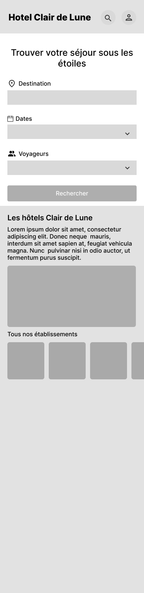
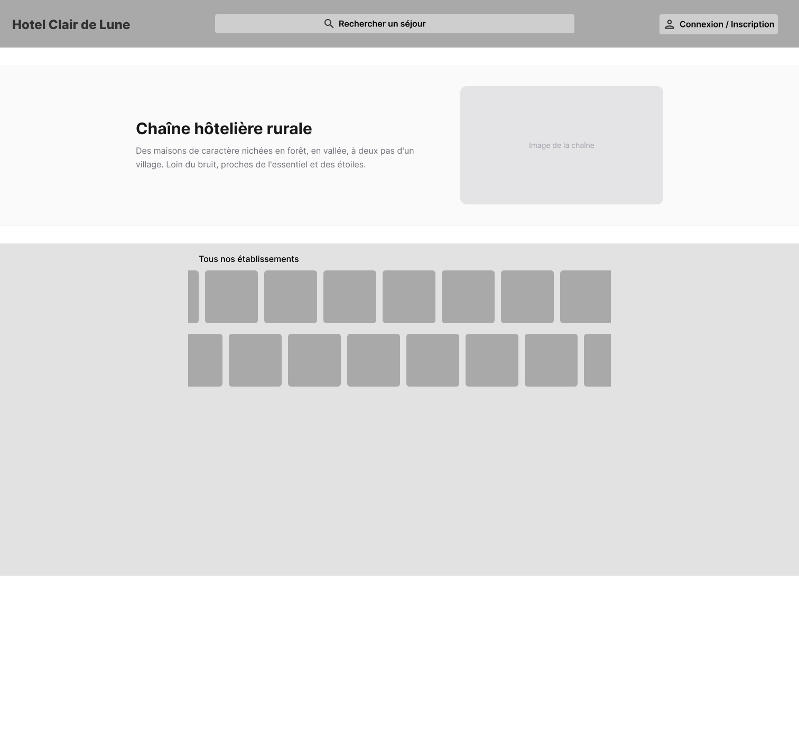
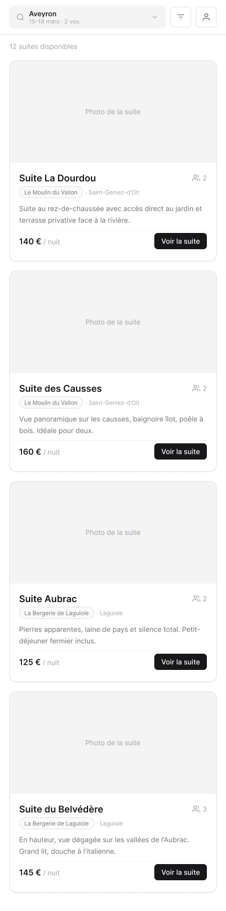
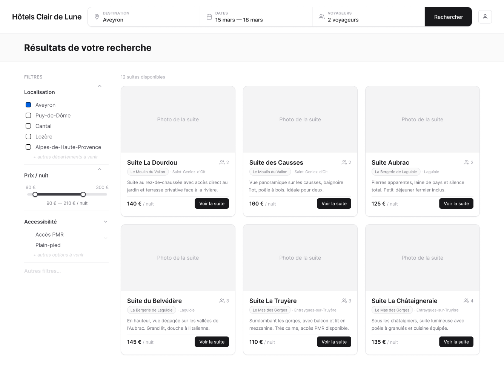
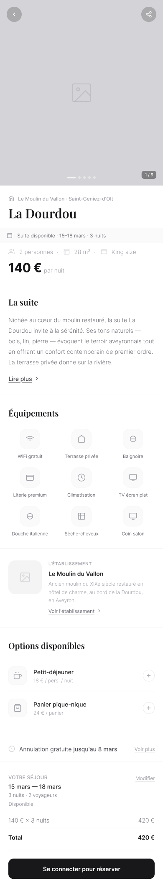
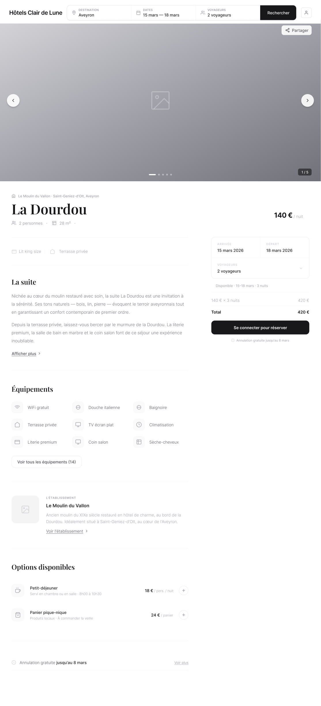

# Charte graphique — Hôtel Clair de Lune

> **Projet :** Application de gestion hôtelière — Hôtel Clair de Lune\
> **Équipe :** Julien Lemarchand, Thélio Trinité, Agathe Boncompain\
> **Date :** Mars 2026

---

## 1. Palette de couleurs

Le design system utilise une palette **neutre (zinc)** en espace colorimétrique OKLCH, avec un mode clair et un mode sombre.

### 1.1 Mode clair (par défaut)

| Rôle | Token CSS | Valeur OKLCH | Hex approx. | Usage |
|------|-----------|-------------|-------------|-------|
| Background | `--background` | `oklch(1 0 0)` | `#FFFFFF` | Fond de page |
| Foreground | `--foreground` | `oklch(0.145 0 0)` | `#0A0A0A` | Texte principal |
| Primary | `--primary` | `oklch(0.205 0 0)` | `#171717` | Boutons, liens principaux |
| Primary text | `--primary-foreground` | `oklch(0.985 0 0)` | `#FAFAFA` | Texte sur primary |
| Secondary | `--secondary` | `oklch(0.97 0 0)` | `#F5F5F5` | Boutons secondaires |
| Muted | `--muted` | `oklch(0.97 0 0)` | `#F5F5F5` | États désactivés |
| Muted text | `--muted-foreground` | `oklch(0.556 0 0)` | `#737373` | Texte secondaire |
| Destructive | `--destructive` | `oklch(0.577 0.245 27.325)` | `#DC2626` | Suppression, erreurs |
| Border | `--border` | `oklch(0.922 0 0)` | `#E5E5E5` | Bordures |

### 1.2 Mode sombre

| Rôle | Token CSS | Valeur OKLCH | Hex approx. |
|------|-----------|-------------|-------------|
| Background | `--background` | `oklch(0.145 0 0)` | `#0A0A0A` |
| Foreground | `--foreground` | `oklch(0.985 0 0)` | `#FAFAFA` |
| Primary | `--primary` | `oklch(0.922 0 0)` | `#E5E5E5` |
| Card | `--card` | `oklch(0.205 0 0)` | `#171717` |
| Destructive | `--destructive` | `oklch(0.704 0.191 22.216)` | `#EF4444` |

### 1.3 Approche

- **Palette achromatic** : tons de gris neutres (chroma = 0), laissant le contenu photographique des hôtels au premier plan
- **Destructive en rouge** : seule couleur chromatique de l'interface, réservée aux actions dangereuses (suppression, erreurs)
- **OKLCH** : espace colorimétrique perceptuellement uniforme, natif Tailwind CSS 4
- **Light/Dark** : basculement via classe `.dark` sur `<html>`

---

## 2. Typographie

### 2.1 Police système

L'application utilise la **stack de polices système** par défaut du navigateur :

```css
font-family: -apple-system, BlinkMacSystemFont, "Segoe UI", Roboto,
             "Helvetica Neue", Arial, sans-serif;
```

**Justification :** performances optimales (aucun téléchargement de police), rendu natif sur chaque OS, cohérence avec les conventions de l'interface système.

### 2.2 Hiérarchie typographique

| Niveau | Élément | Classes Tailwind | Usage |
|--------|---------|-----------------|-------|
| H1 | `<h1>` | `text-3xl font-bold` | Titre de page |
| H2 | `<h2>` | `text-2xl font-semibold` | Sections principales |
| H3 | `<h3>` | `text-xl font-semibold` | Sous-sections |
| Body | `<p>` | `text-base` | Texte courant |
| Small | `<small>` | `text-sm text-muted-foreground` | Labels, légendes |

> **Note :** La hiérarchie ci-dessus reflète les conventions utilisées dans le code. Les tailles exactes peuvent varier selon le contexte (responsive, cards, etc.).

---

## 3. Composants UI

L'interface est construite avec **shadcn/ui** (preset New York, base zinc).

### 3.1 Configuration

| Paramètre | Valeur |
|-----------|--------|
| Style | New York |
| Base color | Zinc |
| CSS Variables | Activées |
| Icônes | Lucide |
| Border radius | `0.625rem` (10px) |

### 3.2 Composants utilisés

| Composant | Usage |
|-----------|-------|
| `Button` | Actions principales (formulaires, navigation, suppression) |
| `Input` | Champs texte des formulaires |
| `Label` | Labels associés aux champs de formulaire |
| `Card` | Conteneurs visuels (cartes établissement, cartes suite, squelettes de chargement) |
| `Select` | Sélection dans les formulaires (ex: établissement dans le formulaire suite) |
| `Textarea` | Champs texte multi-lignes (descriptions) |
| `Skeleton` | États de chargement (listes établissements, listes suites) |
| `AlertDialog` | Confirmation avant suppression (établissements, suites) |

---

## 4. Wireframes

Wireframes de la fonctionnalité **"Consulter les établissements et les suites"** (US4), en version mobile et desktop.

> **Source :** [Figma — Hotel Clair de Lune wireframes](https://www.figma.com/design/CkVjOlkjiNVovuVxl2PdVS/Hotel-Clair-de-Lune---wireframes)

### 4.1 Accueil

Page d'entrée avec recherche de séjour (destination, dates, voyageurs) et aperçu des établissements.

| Mobile | Desktop |
|--------|---------|
|  |  |

### 4.2 Liste des établissements

Page listant tous les établissements du groupe avec nom, ville et description.

| Mobile | Desktop |
|--------|---------|
|  |  |

### 4.3 Recherche

Interface de recherche de séjour avec filtres.

| Mobile | Desktop |
|--------|---------|
|  |  |

### 4.4 Détail d'une suite

Page de détail avec galerie d'images, description, prix et informations de la suite.

| Mobile | Desktop |
|--------|---------|
|  |  |

> **Export :** Depuis Figma, sélectionner chaque frame (Mobile / Desktop) puis File > Export > PNG (2x). Stocker les fichiers dans `docs/deliverables/assets/`.

---

## Références

- [Charte graphique — Google Docs](https://docs.google.com/document/d/1lKRaRJAv9yNGHURP-SydDhMh_ijiVEembWwgXMUnPsI/edit?tab=t.0#heading=h.wnh3puvh5rjv) — Document source de la charte graphique
