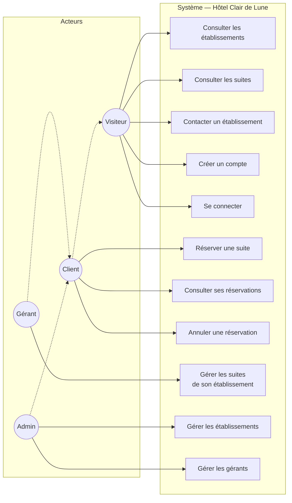

# Documentation technique — Hôtel Clair de Lune

> **Projet :** Application de gestion hôtelière — Hôtel Clair de Lune\
> **Équipe :** Julien Lemarchand, Thélio Trinité, Agathe Boncompain\
> **Date :** Mars 2026

---

## 1. Choix technologiques

### 1.1 Stack retenue

| Couche | Technologie | Justification |
|--------|-------------|---------------|
| Framework | Next.js 15 (App Router) | SSR/RSC natif, routing fichier, Server Actions intégrées |
| Langage | TypeScript | Typage strict, sécurité à la compilation, écosystème React |
| Runtime | Bun | Performances, compatibilité Node.js, package manager intégré |
| UI | React 19 + Tailwind CSS 4 | Server Components, utility-first CSS |
| Composants UI | shadcn/ui (Radix) | Accessibilité ARIA native, personnalisable, non-opinionated |
| Base de données | PostgreSQL 16 | SGBD relationnel robuste, contraintes avancées |
| ORM | Drizzle ORM | Type-safe, SQL-like, zero runtime overhead |
| Authentification | Better Auth | Sessions, rôles, route handler intégré |
| Conteneurisation | Docker + Docker Compose | Environnement reproductible (dev et prod) |

### 1.2 Réflexions sur les choix

**Pourquoi Next.js plutôt qu'un framework MVC classique (Symfony, Django) ?**

Le cahier des charges suggère un framework MVC. Nous avons opté pour Next.js (App Router) car :

- Le pattern RSC (React Server Components) offre une séparation naturelle entre rendu serveur et interactivité client, sans API REST intermédiaire
- Les Server Actions remplacent les contrôleurs MVC pour les mutations, avec validation Zod intégrée
- L'écosystème TypeScript full-stack évite le context-switching entre langages
- Le routing fichier simplifie la correspondance URL ↔ composant

**Pourquoi une architecture feature-based ?**

Plutôt qu'une architecture en couches classique (controllers/, models/, views/), nous avons adopté une organisation par domaine métier (`src/features/{domain}/`). Chaque feature regroupe ses composants, actions, queries et types. Les imports sont unidirectionnels : `shared` est importable par tous, les features importent depuis `shared` uniquement (jamais entre features), `app/` compose les features en pages.

Cette décision est documentée dans [`docs/architecture/feature-based-vs-layered.md`](../architecture/feature-based-vs-layered.md).

**Pourquoi Drizzle ORM plutôt que Prisma ?**

Drizzle offre un SQL-like type-safe avec zero runtime overhead. Le schéma est défini en TypeScript (`src/lib/db/schema.ts`), ce qui permet une correspondance directe avec le MPD documenté en MERISE.

---

## 2. Diagramme de cas d'utilisation

Le diagramme de cas d'utilisation identifie les interactions entre les quatre acteurs (visiteur, client, gérant, administrateur) et le système. Les flèches en pointillés `<<hérite>>` indiquent qu'un acteur possède tous les cas d'utilisation de l'acteur dont il hérite.



> **Héritage des rôles :** L'application utilise un compte unique par utilisateur (pas de double inscription possible). Les actions de réservation sont protégées par `requireSession()` (authentification requise, sans restriction de rôle). Un gérant ou un administrateur peut donc réserver une suite avec son propre compte — il hérite de facto des cas d'utilisation du client.

---

## 3. Modélisation MERISE

La modélisation complète (dictionnaire de données, MCD, MLD, MPD, règles de gestion) est documentée dans [`docs/design/merise.md`](../design/merise.md).

Ce document constitue un chapitre à part entière du livrable et doit être inclus dans le PDF final en tant qu'annexe. Il couvre :

- **MCD** — 9 entités métier, dictionnaire de données, diagramme entité-association, 15 règles de gestion
- **MLD** — Schéma relationnel (15 relations dont 4 tables de jointure), règles de passage MCD → MLD
- **MPD** — Types PostgreSQL, contraintes (NOT NULL, CHECK, UNIQUE, DEFAULT), stratégies ON DELETE (RESTRICT, CASCADE, SET NULL)

L'implémentation directe du MPD est dans `src/lib/db/schema.ts` (Drizzle ORM).

---

## 4. Diagrammes comportementaux

Les diagrammes UML dynamiques sont documentés dans [`docs/design/diagrammes-comportementaux.md`](../design/diagrammes-comportementaux.md). Ils complètent le modèle de données MERISE avec la dimension comportementale :

- **Cycle de vie d'une réservation** (State Diagram) — transitions `pending → confirmed → completed`, conditions d'annulation, snapshot des prix
- **Cycle de vie d'une demande de contact** (State Diagram) — transitions `unread → read → replied`
- **Flux de réservation** (Flowchart) — processus complet du point de vue utilisateur et des contrôles serveur

Ces diagrammes doivent être inclus dans le PDF final en tant qu'annexe.

---

## 5. Architecture applicative

### 5.1 Vue d'ensemble

```
┌─────────────┐     ┌──────────────────────────────┐     ┌─────────────┐
│   Client    │────▶│     Next.js App Router        │────▶│ PostgreSQL  │
│ (Navigateur)│◀────│  (Server Components + Actions)│◀────│  (Drizzle)  │
└─────────────┘     └──────────────────────────────┘     └─────────────┘
```

### 5.2 Organisation du code

```
src/
├── app/                    ← Pages (routing fichier)
├── components/             ← UI partagée (shadcn/ui, layout, forms)
├── features/               ← Modules métier auto-contenus
│   ├── auth/               ←   Authentification (login, register)
│   ├── establishments/     ←   Gestion des établissements
│   ├── suites/             ←   Gestion des suites
│   ├── bookings/           ←   Réservations
│   └── inquiries/          ←   Demandes de contact
├── hooks/                  ← Hooks React partagés
├── lib/                    ← Bibliothèques (db/, auth, utils)
└── types/                  ← Types TypeScript partagés
```

### 5.3 Sécurité

| Aspect | Mesure |
|--------|--------|
| Mots de passe | Hashage bcrypt (Better Auth) |
| Contrôle d'accès | Guards côté serveur (`requireAdmin()`, `requireManager()`, `requireSession()`) |
| Validation | Client (formulaires) + serveur (Server Actions, Zod) |
| Protection CSRF | Natif via Server Actions (vérification `Origin` header) |
| SQL injection | Drizzle ORM — requêtes paramétrées |
| XSS | Échappement automatique par React (JSX) |
