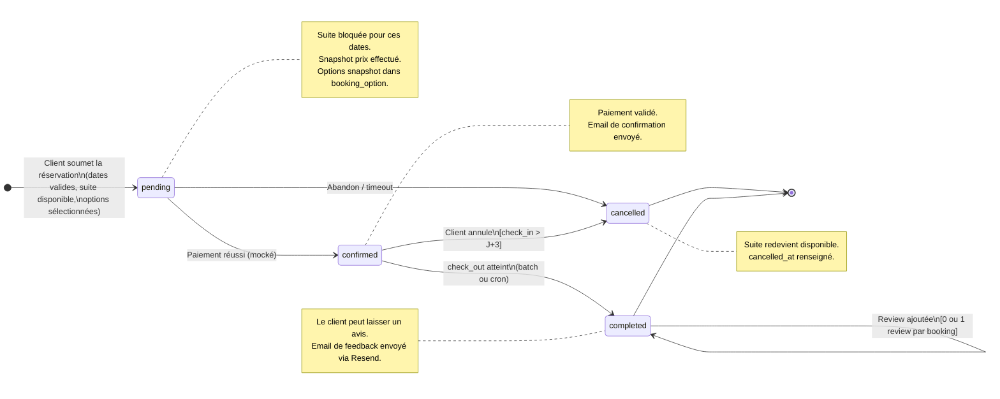
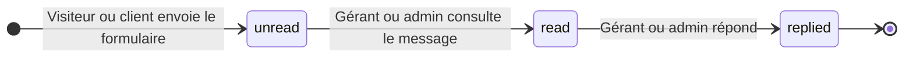
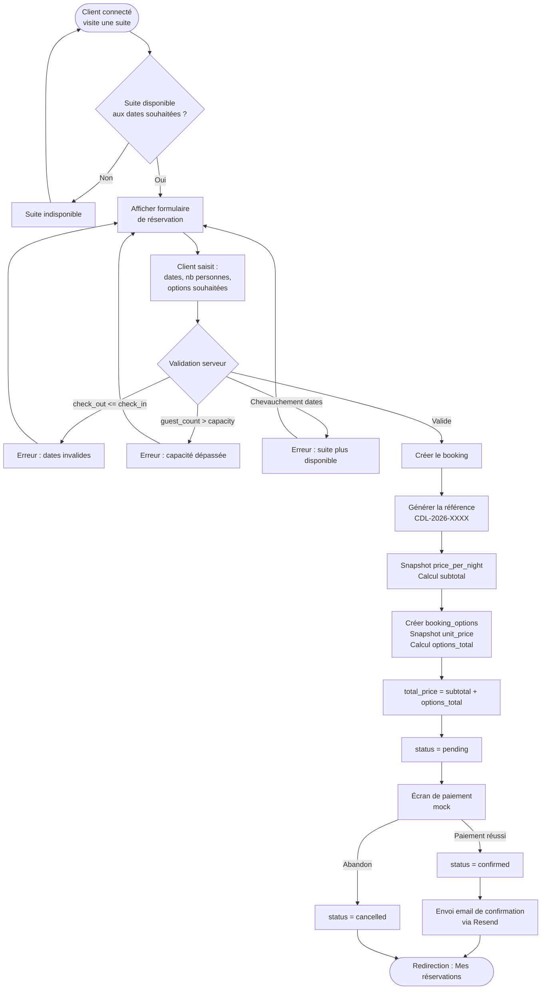

# Diagrammes comportementaux — Hôtel Clair de Lune

> **Auteur :** Julien Lemarchand\
> **Créé le :** 2026-03-17\
> **Dernière mise à jour :** 2026-03-23

Diagrammes UML dynamiques complémentaires au [modèle de données MERISE](./merise.md).

---

## 1. Cycle de vie d'une réservation (State Diagram)

> Ce diagramme d'état modélise les transitions possibles du statut
> d'une réservation (`booking.status`), avec les conditions de garde.

---

## 2. Cycle de vie d'une demande de renseignement (State Diagram)

---

## 3. Flux de réservation (Flowchart)

> Processus complet de création d'une réservation, du point de vue utilisateur
> et des contrôles métier côté serveur. Inclut la sélection d'options.

