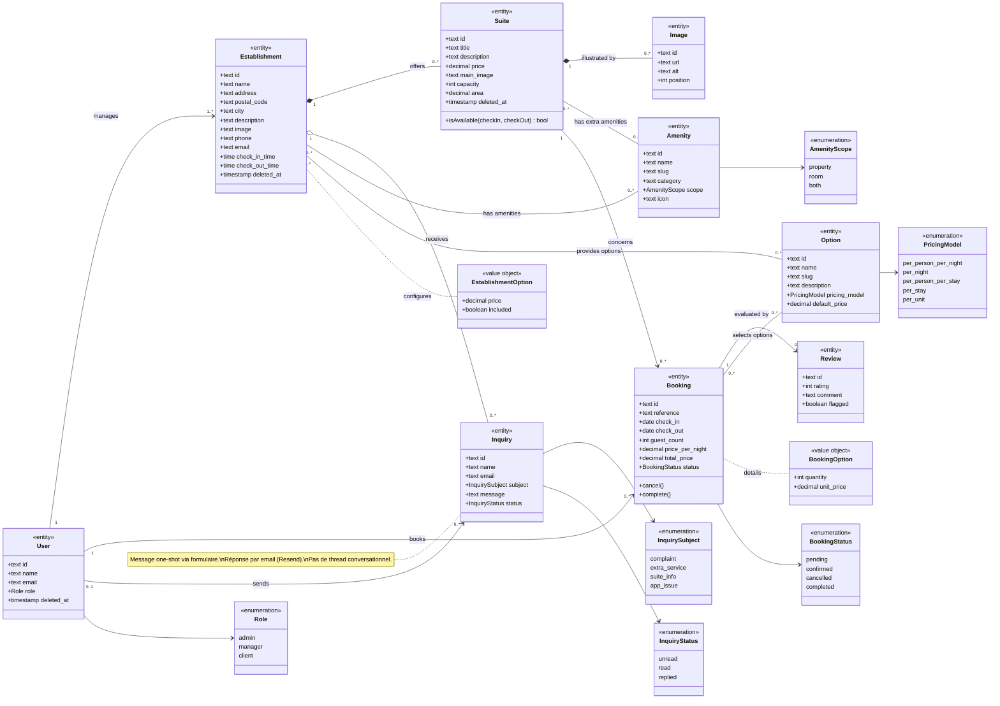
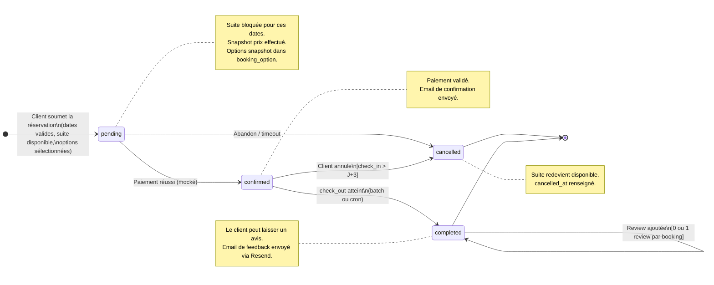
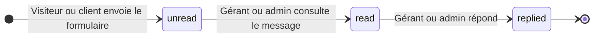
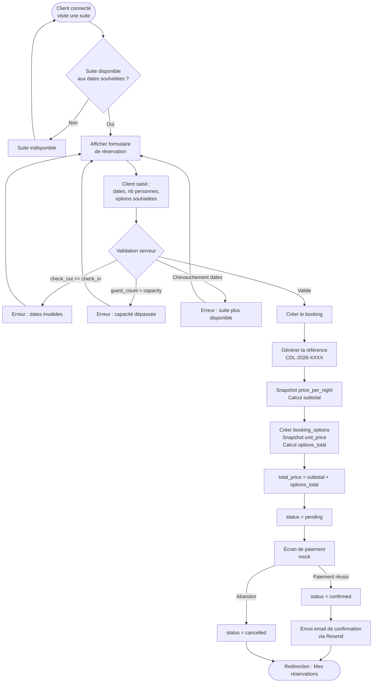

# UML — Hôtel Clair de Lune

> **Auteur :** Julien Lemarchand\
> **Créé le :** 2026-03-17\
> **Dernière mise à jour :** 2026-03-18

Diagrammes UML complémentaires au [dossier MERISE](./merise.md).

---

## 1. Modèle de domaine (Class Diagram)

> Vue orientée objet du domaine métier. Ce diagramme montre les entités
> avec leurs attributs clés, les relations typées (composition, agrégation,
> association) et les multiplicités.

---

## 2. Cycle de vie d'une réservation (State Diagram)

> Ce diagramme d'état modélise les transitions possibles du statut
> d'une réservation (`booking.status`), avec les conditions de garde.

---

## 3. Cycle de vie d'une demande de renseignement (State Diagram)

---

## 4. Flux de réservation (Flowchart)

> Processus complet de création d'une réservation, du point de vue utilisateur
> et des contrôles métier côté serveur. Inclut la sélection d'options.

