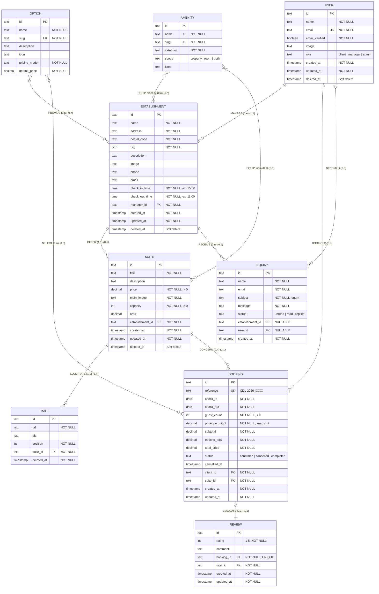
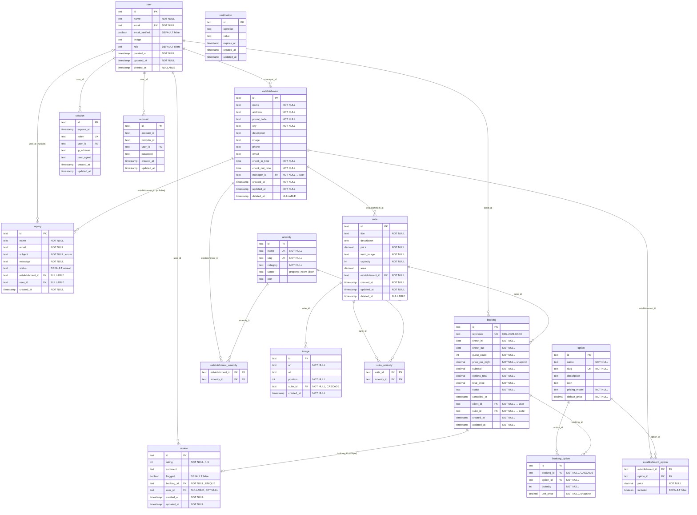
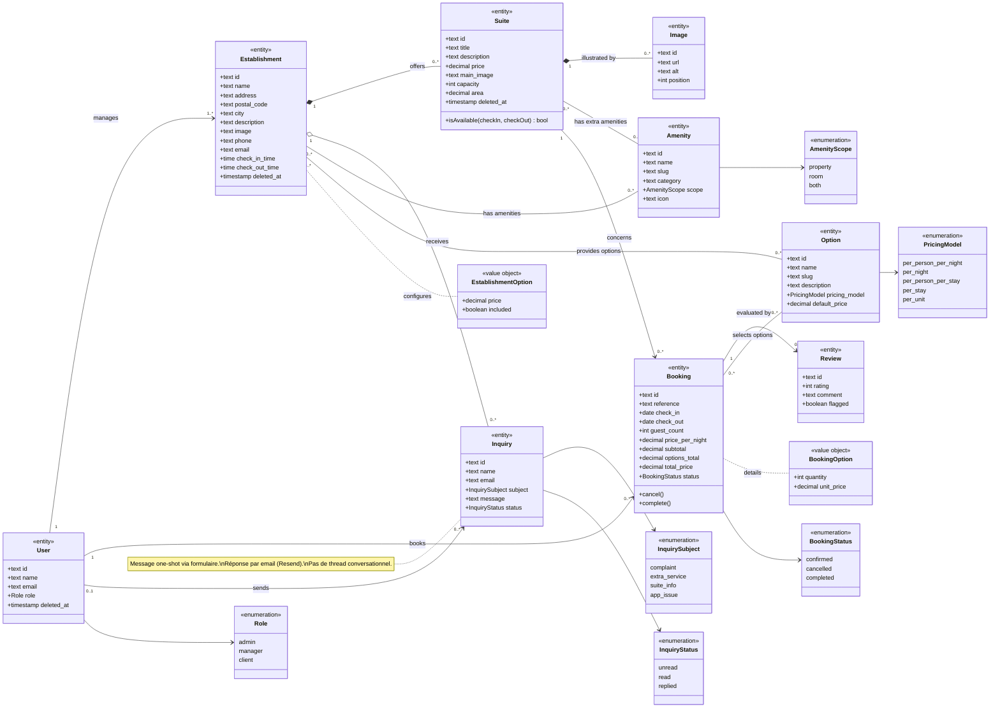
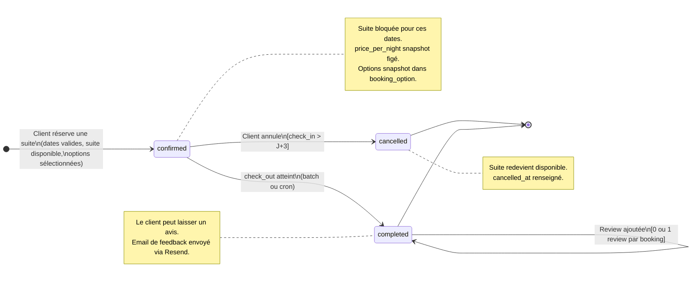
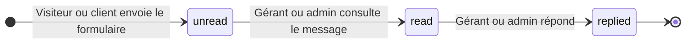

# MERISE — Hôtel Clair de Lune

> **Auteur :** Julien Lemarchand\
> **Créé le :** 2026-03-17\
> **Dernière mise à jour :** 2026-03-17\
> **Décisions validées le :** 2026-03-17

### Convention de nommage

Ce document utilise un **nommage bilingue** : les descriptions et titres de sections sont en français,
mais tous les noms de tables et d'attributs apparaissent en **anglais** — identiques à ce qui sera dans le code.

| Français (doc) | Anglais (code) |
|---|---|
| Utilisateur | `user` |
| Établissement | `establishment` |
| Suite | `suite` |
| Image | `image` |
| Aménité | `amenity` |
| Option | `option` |
| Réservation | `booking` |
| Avis | `review` |
| Demande de inquiry | `inquiry` |

---

## 1. MCD — Modèle Conceptuel de Données

### 1.1 Dictionnaire de données

#### UTILISATEUR (`user`)

| Attribut | Type | Obligatoire | Description |
|---|---|---|---|
| `id` | text | Oui | Clé primaire (géré par Better Auth) |
| `name` | text | Oui | Nom complet |
| `email` | text | Oui | Adresse e-mail (unique) |
| `email_verified` | boolean | Oui | E-mail vérifié |
| `image` | text | Non | Avatar / photo de profil |
| `role` | text | Oui | Rôle : `client`, `manager`, `admin` |
| `created_at` | timestamp | Oui | Date de création |
| `updated_at` | timestamp | Oui | Date de dernière modification |
| `deleted_at` | timestamp | Non | Soft delete (null = actif) |

> **Note :** Les tables `session`, `account` et `verification` de Better Auth ne sont pas représentées
> dans le MCD car elles relèvent de l'infrastructure d'authentification, pas du domaine métier.

#### ÉTABLISSEMENT (`establishment`)

| Attribut | Type | Obligatoire | Description |
|---|---|---|---|
| `id` | text | Oui | Clé primaire |
| `name` | text | Oui | Nom de l'établissement |
| `address` | text | Oui | Adresse postale |
| `postal_code` | text | Oui | Code postal |
| `city` | text | Oui | Ville |
| `description` | text | Non | Description de l'établissement |
| `image` | text | Non | Image principale (URL) |
| `phone` | text | Non | Numéro de téléphone |
| `email` | text | Non | E-mail de inquiry |
| `check_in_time` | time | Oui | Heure d'arrivée (ex: 15:00) |
| `check_out_time` | time | Oui | Heure de départ (ex: 11:00) |
| `manager_id` | text | Oui | FK → `user` (gérant) |
| `created_at` | timestamp | Oui | Date de création |
| `updated_at` | timestamp | Oui | Date de dernière modification |
| `deleted_at` | timestamp | Non | Soft delete (null = actif) |

#### SUITE (`suite`)

| Attribut | Type | Obligatoire | Description |
|---|---|---|---|
| `id` | text | Oui | Clé primaire |
| `title` | text | Oui | Nom de la suite |
| `description` | text | Non | Description détaillée |
| `price` | decimal | Oui | Prix par nuit (fixe) |
| `main_image` | text | Oui | URL de l'image principale |
| `capacity` | integer | Oui | Nombre de personnes max |
| `area` | decimal | Non | Surface en m² |
| `establishment_id` | text | Oui | FK → `establishment` |
| `created_at` | timestamp | Oui | Date de création |
| `updated_at` | timestamp | Oui | Date de dernière modification |
| `deleted_at` | timestamp | Non | Soft delete (null = actif) |

#### IMAGE (`image`)

| Attribut | Type | Obligatoire | Description |
|---|---|---|---|
| `id` | text | Oui | Clé primaire |
| `url` | text | Oui | URL de l'image |
| `alt` | text | Non | Texte alternatif (accessibilité) |
| `position` | integer | Oui | Ordre dans la galerie (UNIQUE par suite) |
| `suite_id` | text | Oui | FK → `suite` |
| `created_at` | timestamp | Oui | Date de création |

#### AMÉNITÉ (`amenity`)

Caractéristique d'un établissement ou d'une suite (WiFi, piscine, douche, PMR…).
Pas de prix associé — c'est un attribut booléen "on l'a ou on ne l'a pas".

| Attribut | Type | Obligatoire | Description |
|---|---|---|---|
| `id` | text | Oui | Clé primaire |
| `name` | text | Oui | Libellé (ex: "WiFi gratuit") |
| `slug` | text | Oui | Identifiant URL/i18n (ex: `wifi-gratuit`) |
| `category` | text | Oui | Catégorie d'affichage (ex: "Salle de bain", "Technologie") |
| `scope` | text | Oui | `property`, `room` ou `both` |
| `icon` | text | Non | Identifiant d'icône UI |

> **Règle de cascade :** si une aménité est cochée au niveau établissement,
> elle s'applique automatiquement à toutes ses suites et ne peut pas être décochée suite par suite.
> En base, on ne duplique pas : on stocke dans `establishment_amenity`, et à l'affichage
> on fusionne avec `suite_amenity` (amenités supplémentaires propres à la suite).

#### OPTION (`option`)

Service achetable ajouté à une réservation (petit-déjeuner, lit supplémentaire, parking…).
A un prix et un modèle de tarification.

| Attribut | Type | Obligatoire | Description |
|---|---|---|---|
| `id` | text | Oui | Clé primaire |
| `name` | text | Oui | Libellé (ex: "Petit-déjeuner") |
| `slug` | text | Oui | Identifiant URL (ex: `breakfast`) |
| `description` | text | Non | Description détaillée |
| `icon` | text | Non | Identifiant d'icône UI |
| `pricing_model` | text | Oui | Modèle de tarification par défaut |
| `default_price` | decimal | Oui | Prix par défaut |

**Modèles de tarification (`pricing_model`) :**

| Valeur | Signification | Exemple |
|---|---|---|
| `per_person_per_night` | Par personne et par nuit | Petit-déjeuner, demi-pension |
| `per_night` | Par nuit | Lit supplémentaire, parking, animal |
| `per_person_per_stay` | Par personne et par séjour | Accès spa |
| `per_stay` | Forfait par séjour | Pack romantique |
| `per_unit` | À l'unité | Panier pique-nique, vélos |

#### OPTION ÉTABLISSEMENT (`establishment_option`)

Configure quelles options sont proposées par chaque établissement, à quel prix,
et si elles sont incluses d'office dans le tarif.
Le modèle de tarification est défini une seule fois dans la table `option` (pas de surcharge par établissement).

| Attribut | Type | Obligatoire | Description |
|---|---|---|---|
| `establishment_id` | text | Oui | FK → `establishment` (PK composite) |
| `option_id` | text | Oui | FK → `option` (PK composite) |
| `price` | decimal | Oui | Prix pratiqué par cet établissement (peut différer du prix par défaut) |
| `included` | boolean | Oui | `true` = inclus dans le tarif (ex: PDJ offert), `false` = en supplément |

#### OPTION RÉSERVATION (`booking_option`)

Options effectivement sélectionnées par le client pour une réservation donnée.
Snapshot du prix au moment de la réservation. Le total par option (`quantity × unit_price`)
est calculé à la volée — pas stocké en base (donnée dérivée).

| Attribut | Type | Obligatoire | Description |
|---|---|---|---|
| `id` | text | Oui | Clé primaire |
| `booking_id` | text | Oui | FK → `booking` |
| `option_id` | text | Oui | FK → `option` |
| `quantity` | integer | Oui | Quantité (ex: nb de vélos loués) |
| `unit_price` | decimal | Oui | Prix unitaire au moment de la réservation (snapshot) |

#### RÉSERVATION (`booking`)

| Attribut | Type | Obligatoire | Description |
|---|---|---|---|
| `id` | text | Oui | Clé primaire |
| `reference` | text | Oui | Référence lisible unique (ex: CDL-2026-0042) |
| `check_in` | date | Oui | Date d'arrivée |
| `check_out` | date | Oui | Date de départ |
| `guest_count` | integer | Oui | Nombre de personnes |
| `price_per_night` | decimal | Oui | Snapshot du prix/nuit au moment de la réservation |
| `subtotal` | decimal | Oui | Sous-total hébergement (nb nuits × prix/nuit) |
| `options_total` | decimal | Oui | Total des options sélectionnées |
| `total_price` | decimal | Oui | Prix total (subtotal + options_total) |
| `status` | text | Oui | `confirmed`, `cancelled`, `completed` |
| `cancelled_at` | timestamp | Non | Date d'annulation (si applicable) |
| `client_id` | text | Oui | FK → `user` |
| `suite_id` | text | Oui | FK → `suite` |
| `created_at` | timestamp | Oui | Date de création de la réservation |
| `updated_at` | timestamp | Oui | Date de dernière modification |

#### AVIS (`review`)

| Attribut | Type | Obligatoire | Description |
|---|---|---|---|
| `id` | text | Oui | Clé primaire |
| `rating` | integer | Oui | Note de 1 à 5 |
| `comment` | text | Non | Commentaire textuel |
| `flagged` | boolean | Oui | Signalé par un gérant (défaut: false) |
| `booking_id` | text | Oui | FK → `booking` (UNIQUE — 1 avis par réservation) |
| `user_id` | text | Non | FK → `user` (SET NULL pour anonymisation RGPD) |
| `created_at` | timestamp | Oui | Date de publication |
| `updated_at` | timestamp | Oui | Date de dernière modification |

> **RGPD :** Un client peut demander la suppression de ses données. L'avis est alors **anonymisé**
> (user_id → null), pas supprimé. Le contenu reste visible.
> **Modération :** Un gérant peut **signaler** un avis (`flagged = true`) mais ne peut pas le supprimer.
> La suppression d'avis négatifs authentiques est interdite (article L121-1 Code de la consommation).

#### DEMANDE DE INQUIRY (`inquiry`)

Message de prise de inquiry soumis via le formulaire du site. Ce n'est pas un thread
conversationnel : c'est un message one-shot. La réponse du gérant/admin est envoyée
par email (via Resend) et le statut passe à `replied`.

| Attribut | Type | Obligatoire | Description |
|---|---|---|---|
| `id` | text | Oui | Clé primaire |
| `name` | text | Oui | Nom de l'expéditeur |
| `email` | text | Oui | E-mail de l'expéditeur |
| `subject` | text | Oui | Sujet prédéfini (enum) |
| `message` | text | Oui | Corps du message |
| `status` | text | Oui | `unread`, `read`, `replied` |
| `establishment_id` | text | Non | FK → `establishment` (nullable : null = sujet technique global) |
| `user_id` | text | Non | FK → `user` (nullable : null = visiteur non connecté) |
| `created_at` | timestamp | Oui | Date d'envoi |

### 1.2 Entités et associations

> Le diagramme ci-dessous utilise la notation ERD de Mermaid pour représenter
> le MCD. Les cardinalités sont exprimées avec la notation Crow's Foot.



### 1.3 Détail des associations et cardinalités

| Association | Entité A | Card. A | Entité B | Card. B | Description |
|---|---|---|---|---|---|
| **MANAGE** | User (manager) | 1,n | Establishment | 1,1 | Un gérant gère 1 à N établissements. Un établissement a exactement un gérant. |
| **OFFER** | Establishment | 1,1 | Suite | 0,n | Un établissement propose 0 à N suites. Une suite appartient à un seul établissement. |
| **ILLUSTRATE** | Suite | 1,1 | Image | 0,n | Une suite possède 0 à N images dans sa galerie. |
| **EQUIP (property)** | Establishment | 0,n | Amenity | 0,n | Un établissement dispose de 0 à N aménités. Many-to-many via `establishment_amenity`. |
| **EQUIP (room)** | Suite | 0,n | Amenity | 0,n | Une suite dispose de 0 à N aménités supplémentaires. Many-to-many via `suite_amenity`. |
| **PROVIDE** | Establishment | 0,n | Option | 0,n | Un établissement propose 0 à N options payantes. Many-to-many via `establishment_option` (avec prix et flag `included`). |
| **BOOK** | User (client) | 1,1 | Booking | 0,n | Un client effectue 0 à N réservations. |
| **SELECT** | Booking | 0,n | Option | 0,n | Une réservation inclut 0 à N options. Many-to-many via `booking_option` (avec quantité et prix snapshot). |
| **CONCERN** | Suite | 0,n | Booking | 1,1 | Une suite est concernée par 0 à N réservations. |
| **EVALUATE** | Booking | 0,1 | Review | 1,1 | Une réservation peut avoir 0 ou 1 avis. |
| **RECEIVE** | Establishment | 0,n | Inquiry | 0,1 | Un établissement reçoit 0 à N messages (nullable si sujet technique). |
| **SEND** | User | 0,n | Inquiry | 0,1 | Un user connecté peut envoyer 0 à N messages (nullable si visiteur anonyme). |

### 1.4 Règles de gestion

1. **Rôles :** Un utilisateur a un seul rôle (`admin`, `manager`, `client`). Le visiteur n'est pas un utilisateur (pas de compte).
2. **Gérant → Établissement(s) :** Relation 1:N. Un gérant peut gérer plusieurs établissements (ex: hôtels proches géographiquement). Un établissement a exactement un gérant.
3. **Check-in / Check-out :** Chaque établissement définit ses horaires d'arrivée et de départ. Purement informatif, pas de logique de disponibilité horaire.
4. **Prix fixe :** Le prix d'une suite est fixe quelle que soit la période. Au moment de la réservation, le prix est copié (`price_per_night`) pour garantir l'intégrité historique.
5. **Disponibilité :** Une suite ne peut pas être réservée deux fois sur des dates qui se chevauchent (contrôle : `new_check_in < existing_check_out AND new_check_out > existing_check_in`).
6. **Annulation :** Possible uniquement si la date d'arrivée est dans plus de 3 jours. Le statut passe à `cancelled`, la suite redevient disponible.
7. **Suppression douce :** Les établissements, suites et utilisateurs ne sont jamais supprimés physiquement. Le champ `deleted_at` est renseigné.
8. **Aménités — cascade :** Si une aménité est cochée au niveau établissement, elle s'applique à toutes ses suites automatiquement et ne peut pas être décochée suite par suite. Les suites peuvent avoir des aménités supplémentaires.
9. **Options — inclusion :** Un établissement peut marquer une option comme `included = true` (ex: petit-déjeuner offert). Les options incluses ne sont pas facturées au client.
10. **Options — snapshot prix :** Au moment de la réservation, les prix des options sélectionnées sont copiés dans `booking_option` pour garantir l'intégrité historique.
11. **Prix total :** `total_price = subtotal + options_total`, où `subtotal = nb_nuits × price_per_night` et `options_total = somme des (booking_option.quantity × booking_option.unit_price)`.
12. **Review :** Un avis ne peut être laissé que sur une réservation au statut `completed`, et un seul avis par réservation. Un gérant peut signaler un avis (`flagged = true`) mais ne peut pas le supprimer (article L121-1 Code de la consommation).
13. **Review — RGPD :** En cas de demande de suppression de données, l'avis est anonymisé (`user_id → null`), pas supprimé.
14. **Inquiry :** Message one-shot via formulaire. Les sujets sont prédéfinis (`complaint`, `extra_service`, `suite_info`, `app_issue`). Le champ `establishment_id` est null pour les sujets techniques (routés vers l'admin). Le champ `user_id` est null pour les visiteurs anonymes. La réponse est envoyée par email via Resend, pas de thread in-app.

---

## 2. MLD — Modèle Logique de Données

> Le MLD est la traduction du MCD en tables relationnelles. Chaque entité devient une table,
> chaque association se traduit par une clé étrangère (relation 1:N) ou une table de jointure (relation N:N).

### 2.1 Règles de passage MCD → MLD appliquées

| Règle | Application dans notre modèle |
|---|---|
| Entité → Table | Chaque entité du MCD devient une table |
| Association 1:N → FK | La clé étrangère est placée côté "N" (ex: `establishment.manager_id`) |
| Association N:N → Table de jointure | EQUIP → `establishment_amenity` + `suite_amenity` ; PROVIDE → `establishment_option` ; SELECT → `booking_option` |
| Association 1:1 → FK + contrainte UNIQUE | EVALUATE → `review.booking_id` UNIQUE |

### 2.2 Schéma relationnel

#### Tables issues de Better Auth (infrastructure — déjà en place)

```
session (id, expires_at, token, created_at, updated_at, ip_address, user_agent, #user_id)
account (id, account_id, provider_id, #user_id, access_token, refresh_token, id_token,
         access_token_expires_at, refresh_token_expires_at, scope, password, created_at, updated_at)
verification (id, identifier, value, expires_at, created_at, updated_at)
```

> Ces tables ne sont pas modifiées. Elles sont gérées par Better Auth.

#### Tables métier

```
user (id, name, email, email_verified, image, role, created_at, updated_at, deleted_at)
  PK: id
  UNIQUE: email
  CHECK: role IN ('admin', 'manager', 'client')
  DEFAULT: role = 'client'
  NOTE: table existante Better Auth, enrichie avec role + deleted_at

establishment (id, name, address, postal_code, city, description, image, phone, email,
               check_in_time, check_out_time, created_at, updated_at, deleted_at, #manager_id)
  PK: id
  FK: manager_id → user(id) ON DELETE RESTRICT
  NOT NULL: name, address, postal_code, city, check_in_time, check_out_time, manager_id

suite (id, title, description, price, main_image, capacity, area,
       created_at, updated_at, deleted_at, #establishment_id)
  PK: id
  FK: establishment_id → establishment(id) ON DELETE RESTRICT
  NOT NULL: title, price, main_image, capacity, establishment_id
  CHECK: price > 0, capacity > 0

image (id, url, alt, position, created_at, #suite_id)
  PK: id
  FK: suite_id → suite(id) ON DELETE CASCADE
  NOT NULL: url, position, suite_id
  UNIQUE: (suite_id, position) — pas deux images au même rang dans une suite

amenity (id, name, slug, category, scope, icon)
  PK: id
  UNIQUE: name, slug
  CHECK: scope IN ('property', 'room', 'both')
  NOT NULL: name, slug, category, scope

establishment_amenity (#establishment_id, #amenity_id)
  PK: (establishment_id, amenity_id)
  FK: establishment_id → establishment(id) ON DELETE CASCADE
  FK: amenity_id → amenity(id) ON DELETE CASCADE

suite_amenity (#suite_id, #amenity_id)
  PK: (suite_id, amenity_id)
  FK: suite_id → suite(id) ON DELETE CASCADE
  FK: amenity_id → amenity(id) ON DELETE CASCADE

option (id, name, slug, description, icon, pricing_model, default_price)
  PK: id
  UNIQUE: slug
  CHECK: pricing_model IN ('per_person_per_night', 'per_night',
         'per_person_per_stay', 'per_stay', 'per_unit')
  NOT NULL: name, slug, pricing_model, default_price

establishment_option (#establishment_id, #option_id, price, included)
  PK: (establishment_id, option_id)
  FK: establishment_id → establishment(id) ON DELETE CASCADE
  FK: option_id → option(id) ON DELETE CASCADE
  NOT NULL: price, included
  DEFAULT: included = false

booking (id, reference, check_in, check_out, guest_count, price_per_night,
         subtotal, options_total, total_price, status, cancelled_at,
         created_at, updated_at, #client_id, #suite_id)
  PK: id
  UNIQUE: reference
  FK: client_id → user(id) ON DELETE RESTRICT
  FK: suite_id → suite(id) ON DELETE RESTRICT
  NOT NULL: reference, check_in, check_out, guest_count, price_per_night,
            subtotal, options_total, total_price, status, client_id, suite_id
  CHECK: status IN ('confirmed', 'cancelled', 'completed')
  CHECK: check_out > check_in
  CHECK: price_per_night > 0, subtotal > 0, total_price > 0, guest_count > 0
  CHECK: options_total >= 0
  CONTRAINTE METIER: pas de chevauchement de dates pour une même suite

booking_option (id, quantity, unit_price, #booking_id, #option_id)
  PK: id
  FK: booking_id → booking(id) ON DELETE CASCADE
  FK: option_id → option(id) ON DELETE RESTRICT
  NOT NULL: quantity, unit_price, booking_id, option_id
  CHECK: quantity > 0, unit_price >= 0
  UNIQUE: (booking_id, option_id) — une même option ne peut être ajoutée qu'une fois par réservation
  NOTE: total par option = quantity × unit_price (calculé à la volée, pas stocké)

review (id, rating, comment, flagged, created_at, updated_at, #booking_id, #user_id)
  PK: id
  UNIQUE: booking_id  (un seul avis par réservation)
  FK: booking_id → booking(id) ON DELETE CASCADE
  FK: user_id → user(id) ON DELETE SET NULL  -- anonymisation RGPD
  NOT NULL: rating, booking_id
  DEFAULT: flagged = false
  CHECK: rating BETWEEN 1 AND 5
  CONTRAINTE METIER: réservation au statut 'completed' uniquement

inquiry (id, name, email, subject, message, status, created_at, #establishment_id, #user_id)
  PK: id
  FK: establishment_id → establishment(id) ON DELETE SET NULL  -- NULLABLE
  FK: user_id → user(id) ON DELETE SET NULL  -- NULLABLE
  NOT NULL: name, email, subject, message, status
  CHECK: subject IN ('complaint', 'extra_service', 'suite_info', 'app_issue')
  CHECK: status IN ('unread', 'read', 'replied')
  DEFAULT: status = 'unread'
```

### 2.3 Diagramme relationnel (MLD)

> Ce diagramme ERD Mermaid représente le MLD complet avec toutes les tables,
> y compris les tables de jointure issues des relations N:N.



### 2.4 Récapitulatif des clés étrangères

| Table source | Colonne FK | Table cible | Cardinalité | ON DELETE |
|---|---|---|---|---|
| `establishment` | `manager_id` | `user` | N:1 | RESTRICT |
| `suite` | `establishment_id` | `establishment` | N:1 | RESTRICT |
| `image` | `suite_id` | `suite` | N:1 | CASCADE |
| `establishment_amenity` | `establishment_id` | `establishment` | N:N | CASCADE |
| `establishment_amenity` | `amenity_id` | `amenity` | N:N | CASCADE |
| `suite_amenity` | `suite_id` | `suite` | N:N | CASCADE |
| `suite_amenity` | `amenity_id` | `amenity` | N:N | CASCADE |
| `establishment_option` | `establishment_id` | `establishment` | N:N | CASCADE |
| `establishment_option` | `option_id` | `option` | N:N | CASCADE |
| `booking` | `client_id` | `user` | N:1 | RESTRICT |
| `booking` | `suite_id` | `suite` | N:1 | RESTRICT |
| `booking_option` | `booking_id` | `booking` | N:1 | CASCADE |
| `booking_option` | `option_id` | `option` | N:1 | RESTRICT |
| `review` | `booking_id` | `booking` | 1:1 | CASCADE |
| `review` | `user_id` | `user` | N:1 (nullable) | SET NULL |
| `inquiry` | `establishment_id` | `establishment` | N:1 (nullable) | SET NULL |
| `inquiry` | `user_id` | `user` | N:1 (nullable) | SET NULL |

### 2.5 Choix des ON DELETE

| Stratégie | Appliquée quand | Exemple |
|---|---|---|
| **RESTRICT** | Empêcher la suppression si des données liées existent | Supprimer un user qui a des réservations → bloqué |
| **CASCADE** | La suppression en cascade est logique métier | Supprimer une suite → ses images de galerie et ses amenity links disparaissent |
| **SET NULL** | Le lien peut devenir orphelin sans casser la logique | Supprimer un établissement → les inquirys restent (establishment_id = null) |

> **Note :** En pratique, grâce au soft delete (`deleted_at`), on ne supprime presque jamais physiquement
> un établissement, une suite ou un user. Les ON DELETE RESTRICT servent de filet de sécurité.

---

## 3. Diagrammes complémentaires

### 3.1 Modèle de domaine (Class Diagram)

> Vue orientée objet du domaine métier. Ce diagramme montre les entités
> avec leurs attributs clés, les relations typées (composition, agrégation,
> association) et les multiplicités.



### 3.2 Cycle de vie d'une réservation (State Diagram)

> Ce diagramme d'état modélise les transitions possibles du statut
> d'une réservation (`booking.status`), avec les conditions de garde.



### 3.3 Cycle de vie d'un message de inquiry (State Diagram)



### 3.4 Flux de réservation (Flowchart)

> Processus complet de création d'une réservation, du point de vue utilisateur
> et des contrôles métier côté serveur. Inclut la sélection d'options.


---

## 4. Données de seed

### 4.1 Aménités par défaut (~35)

#### Niveau établissement (`scope: property` ou `both`)

| Catégorie | Aménités |
|---|---|
| **Stationnement** | Parking gratuit, Borne recharge VE |
| **Restauration** | Restaurant, Bar / salon, Petit-déjeuner disponible |
| **Bien-être** | Piscine extérieure, Piscine intérieure, Spa / jacuzzi, Sauna, Jardin |
| **Services** | Réception 24h, Bagagerie, Ménage quotidien |
| **Accessibilité** | Accès PMR, Ascenseur |
| **Animaux** | Animaux acceptés |
| **Technologie** | WiFi gratuit (parties communes) |

#### Niveau suite (`scope: room` ou `both`)

| Catégorie | Aménités |
|---|---|
| **Salle de bain** | Douche, Baignoire, Sèche-cheveux, Articles de toilette, Peignoirs |
| **Technologie** | WiFi gratuit, TV écran plat, Prises USB |
| **Confort** | Climatisation, Chauffage, Insonorisation |
| **Boissons** | Minibar, Bouilloire, Machine Nespresso |
| **Mobilier** | Coffre-fort, Bureau, Penderie |
| **Extérieur** | Balcon, Terrasse privée |
| **Accessibilité** | Accessible fauteuil roulant, Salle de bain PMR |

### 4.2 Options par défaut (10)

| Option | `pricing_model` | Prix par défaut |
|---|---|---|
| Petit-déjeuner | `per_person_per_night` | 14 EUR |
| Demi-pension | `per_person_per_night` | 35 EUR |
| Lit supplémentaire | `per_night` | 20 EUR |
| Lit bébé | `per_night` | 0 EUR |
| Supplément animal | `per_night` | 10 EUR |
| Parking payant | `per_night` | 8 EUR |
| Accès spa | `per_person_per_stay` | 25 EUR |
| Panier pique-nique | `per_unit` | 18 EUR |
| Location vélos | `per_unit` | 15 EUR |
| Pack romantique | `per_stay` | 45 EUR |

---

## 5. MPD — Modèle Physique de Données

_Correspondra au schéma Drizzle dans `src/lib/db/schema.ts`._
