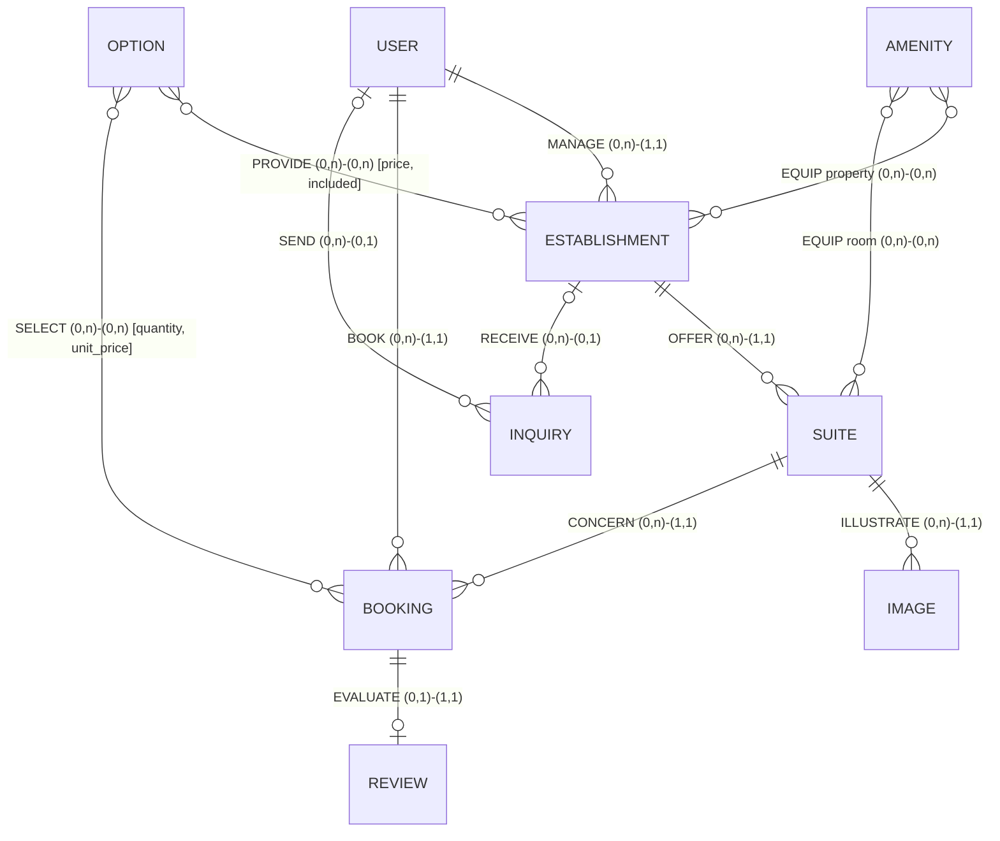
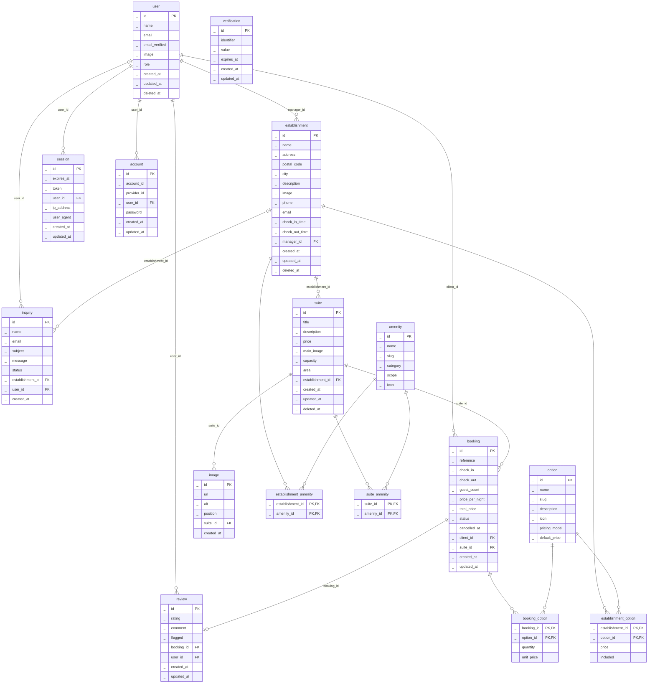
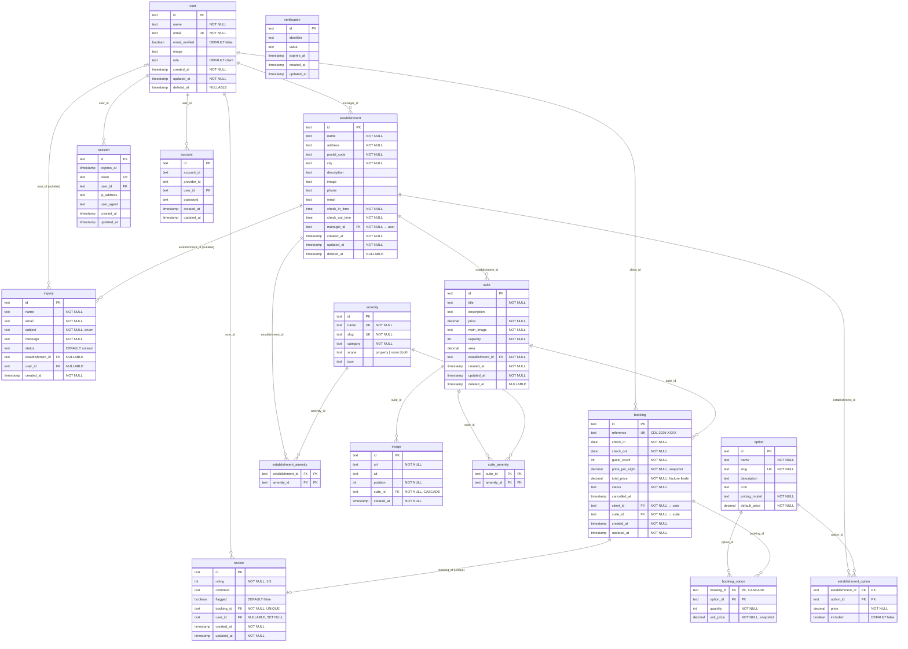
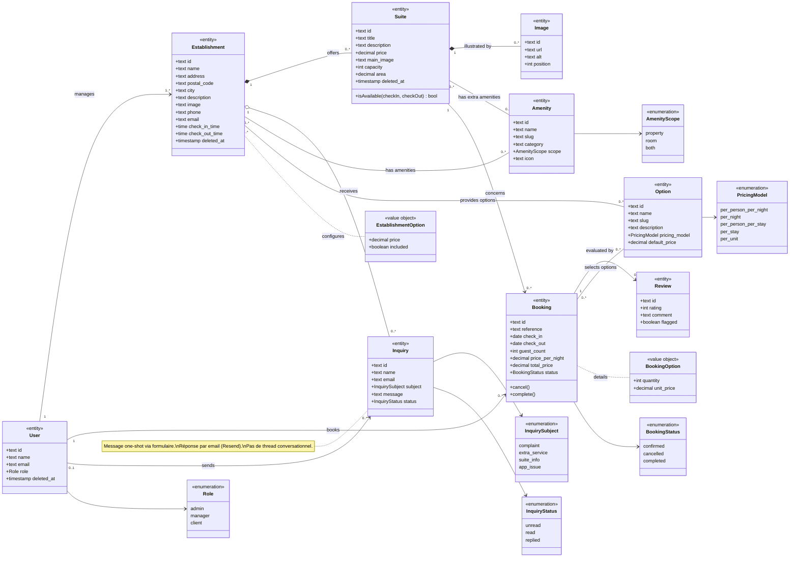
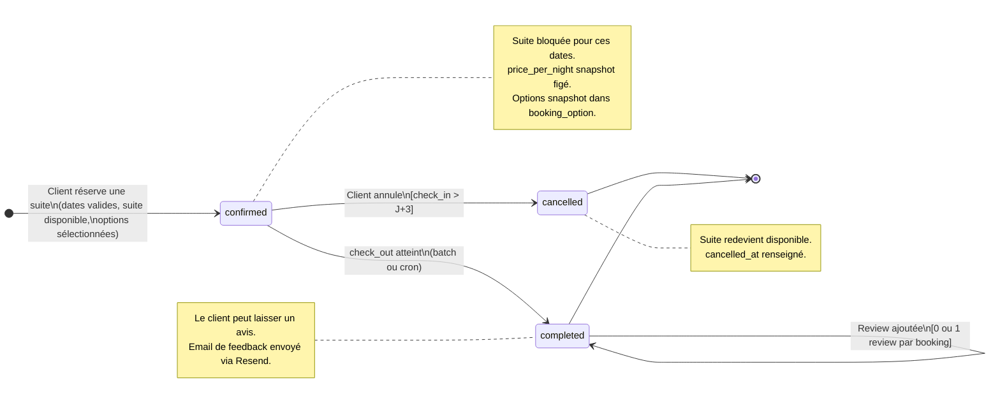
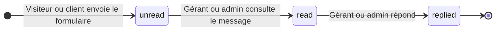
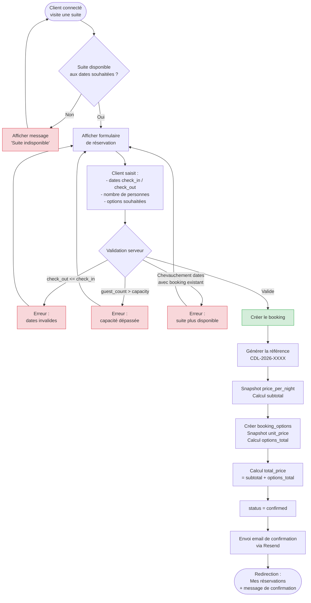

# MERISE — Hôtel Clair de Lune

> **Auteur :** Julien Lemarchand\
> **Créé le :** 2026-03-17\
> **Dernière mise à jour :** 2026-03-17\
> **Décisions validées le :** 2026-03-17

### Cible technique

**SGBD cible : PostgreSQL** (via Drizzle ORM + `drizzle-orm/pg-core`).
Les types physiques (SQL) n'apparaissent qu'au niveau MPD (section 3).

### Convention de nommage

Ce document utilise un **nommage bilingue** : les descriptions et titres de sections sont en français,
mais tous les noms de tables et d'attributs apparaissent en **anglais** — identiques à ce qui sera dans le code.

| Français (doc) | Anglais (code) |
|---|---|
| Utilisateur | `user` |
| Établissement | `establishment` |
| Suite | `suite` |
| Image | `image` |
| Aménité | `amenity` |
| Option | `option` |
| Réservation | `booking` |
| Avis | `review` |
| Demande de renseignement | `inquiry` |

---

## 1. MCD — Modèle Conceptuel de Données

> Le MCD décrit le domaine métier de manière **indépendante de toute technologie**.
> Il utilise le formalisme Entité-Association : des **entités** (objets métier), des **propriétés**
> (caractéristiques), des **associations** (liens entre entités) et des **cardinalités** (règles de participation).
>
> **Ce qui n'apparaît PAS au niveau MCD :** clés étrangères, types SQL, contraintes physiques (NOT NULL, CHECK, DEFAULT),
> indexes, tables de jointure. Ces concepts relèvent du MLD ou du MPD.

### 1.1 Dictionnaire de données

> Les types ci-dessous sont des **types conceptuels** (texte, numérique, etc.), pas des types SQL.
> Les types physiques PostgreSQL seront formalisés au MPD (section 3).
> Les clés étrangères n'apparaissent pas ici — les liens entre entités sont exprimés
> par les associations (section 1.3).

#### UTILISATEUR (`user`)

| Propriété | Type conceptuel | Obligatoire | Description |
|---|---|---|---|
| `id` | texte | Oui | Identifiant (géré par Better Auth) |
| `name` | texte | Oui | Nom complet |
| `email` | texte | Oui | Adresse e-mail (unique) |
| `email_verified` | booléen | Oui | E-mail vérifié |
| `image` | texte | Non | Avatar / photo de profil |
| `role` | texte | Oui | Rôle : `client`, `manager`, `admin` |
| `created_at` | horodatage | Oui | Date de création |
| `updated_at` | horodatage | Oui | Date de dernière modification |
| `deleted_at` | horodatage | Non | Soft delete (null = actif) |

> **Note :** Les tables `session`, `account` et `verification` de Better Auth ne sont pas représentées
> dans le MCD car elles relèvent de l'infrastructure d'authentification, pas du domaine métier.

#### ÉTABLISSEMENT (`establishment`)

| Propriété | Type conceptuel | Obligatoire | Description |
|---|---|---|---|
| `id` | texte | Oui | Identifiant |
| `name` | texte | Oui | Nom de l'établissement |
| `address` | texte | Oui | Adresse postale |
| `postal_code` | texte | Oui | Code postal |
| `city` | texte | Oui | Ville |
| `description` | texte | Non | Description de l'établissement |
| `image` | texte | Non | Image principale (URL) |
| `phone` | texte | Non | Numéro de téléphone |
| `email` | texte | Non | E-mail de contact |
| `check_in_time` | heure | Oui | Heure d'arrivée (ex: 15:00) |
| `check_out_time` | heure | Oui | Heure de départ (ex: 11:00) |
| `created_at` | horodatage | Oui | Date de création |
| `updated_at` | horodatage | Oui | Date de dernière modification |
| `deleted_at` | horodatage | Non | Soft delete (null = actif) |

#### SUITE (`suite`)

| Propriété | Type conceptuel | Obligatoire | Description |
|---|---|---|---|
| `id` | texte | Oui | Identifiant |
| `title` | texte | Oui | Nom de la suite |
| `description` | texte | Non | Description détaillée |
| `price` | décimal | Oui | Prix par nuit (fixe) |
| `main_image` | texte | Oui | URL de l'image principale |
| `capacity` | entier | Oui | Nombre de personnes max |
| `area` | décimal | Non | Surface en m² |
| `created_at` | horodatage | Oui | Date de création |
| `updated_at` | horodatage | Oui | Date de dernière modification |
| `deleted_at` | horodatage | Non | Soft delete (null = actif) |

#### IMAGE (`image`)

| Propriété | Type conceptuel | Obligatoire | Description |
|---|---|---|---|
| `id` | texte | Oui | Identifiant |
| `url` | texte | Oui | URL de l'image |
| `alt` | texte | Non | Texte alternatif (accessibilité) |
| `position` | entier | Oui | Ordre dans la galerie (unique par suite) |
| `created_at` | horodatage | Oui | Date de création |

#### AMÉNITÉ (`amenity`)

Caractéristique d'un établissement ou d'une suite (WiFi, piscine, douche, PMR…).
Pas de prix associé — c'est un attribut booléen "on l'a ou on ne l'a pas".

| Propriété | Type conceptuel | Obligatoire | Description |
|---|---|---|---|
| `id` | texte | Oui | Identifiant |
| `name` | texte | Oui | Libellé (ex: "WiFi gratuit") |
| `slug` | texte | Oui | Identifiant URL/i18n (ex: `wifi-gratuit`) |
| `category` | texte | Oui | Catégorie d'affichage (ex: "Salle de bain", "Technologie") |
| `scope` | texte | Oui | `property`, `room` ou `both` |
| `icon` | texte | Non | Identifiant d'icône UI |

> **Règle de cascade :** si une aménité est cochée au niveau établissement,
> elle s'applique automatiquement à toutes ses suites et ne peut pas être décochée suite par suite.
> En base, on ne duplique pas : on stocke le lien au niveau établissement, et à l'affichage
> on fusionne avec les aménités supplémentaires propres à la suite.

#### OPTION (`option`)

Service achetable ajouté à une réservation (petit-déjeuner, lit supplémentaire, parking…).
A un prix et un modèle de tarification.

| Propriété | Type conceptuel | Obligatoire | Description |
|---|---|---|---|
| `id` | texte | Oui | Identifiant |
| `name` | texte | Oui | Libellé (ex: "Petit-déjeuner") |
| `slug` | texte | Oui | Identifiant URL (ex: `breakfast`) |
| `description` | texte | Non | Description détaillée |
| `icon` | texte | Non | Identifiant d'icône UI |
| `pricing_model` | texte | Oui | Modèle de tarification par défaut |
| `default_price` | décimal | Oui | Prix par défaut |

**Modèles de tarification (`pricing_model`) :**

| Valeur | Signification | Exemple |
|---|---|---|
| `per_person_per_night` | Par personne et par nuit | Petit-déjeuner, demi-pension |
| `per_night` | Par nuit | Lit supplémentaire, parking, animal |
| `per_person_per_stay` | Par personne et par séjour | Accès spa |
| `per_stay` | Forfait par séjour | Pack romantique |
| `per_unit` | À l'unité | Panier pique-nique, vélos |

#### RÉSERVATION (`booking`)

| Propriété | Type conceptuel | Obligatoire | Description |
|---|---|---|---|
| `id` | texte | Oui | Identifiant |
| `reference` | texte | Oui | Référence lisible unique (ex: CDL-2026-0042) |
| `check_in` | date | Oui | Date d'arrivée |
| `check_out` | date | Oui | Date de départ |
| `guest_count` | entier | Oui | Nombre de personnes |
| `price_per_night` | décimal | Oui | Snapshot du prix/nuit au moment de la réservation |
| `total_price` | décimal | Oui | Prix total facturé, figé (hébergement + options) |
| `status` | texte | Oui | `confirmed`, `cancelled`, `completed` |
| `cancelled_at` | horodatage | Non | Date d'annulation (si applicable) |
| `created_at` | horodatage | Oui | Date de création de la réservation |
| `updated_at` | horodatage | Oui | Date de dernière modification |

#### AVIS (`review`)

| Propriété | Type conceptuel | Obligatoire | Description |
|---|---|---|---|
| `id` | texte | Oui | Identifiant |
| `rating` | entier | Oui | Note de 1 à 5 |
| `comment` | texte | Non | Commentaire textuel |
| `flagged` | booléen | Oui | Signalé par un gérant (défaut: false) |
| `created_at` | horodatage | Oui | Date de publication |
| `updated_at` | horodatage | Oui | Date de dernière modification |

> **RGPD :** Un client peut demander la suppression de ses données. L'avis est alors **anonymisé**
> (lien vers l'utilisateur supprimé), pas supprimé. Le contenu reste visible.
> **Modération :** Un gérant peut **signaler** un avis (`flagged = true`) mais ne peut pas le supprimer.
> La suppression d'avis négatifs authentiques est interdite (article L121-1 Code de la consommation).

#### DEMANDE DE RENSEIGNEMENT (`inquiry`)

Message de prise de contact soumis via le formulaire du site. Ce n'est pas un thread
conversationnel : c'est un message one-shot. La réponse du gérant/admin est envoyée
par email (via Resend) et le statut passe à `replied`.

| Propriété | Type conceptuel | Obligatoire | Description |
|---|---|---|---|
| `id` | texte | Oui | Identifiant |
| `name` | texte | Oui | Nom de l'expéditeur |
| `email` | texte | Oui | E-mail de l'expéditeur |
| `subject` | texte | Oui | Sujet prédéfini (enum) |
| `message` | texte | Oui | Corps du message |
| `status` | texte | Oui | `unread`, `read`, `replied` |
| `created_at` | horodatage | Oui | Date d'envoi |

### 1.2 Diagramme entité-association (MCD)

> Diagramme entité-association au format Mermaid ERD (notation Crow's Foot pour les cardinalités).
> Conformément au formalisme MCD, ce diagramme ne montre **ni clés étrangères, ni types, ni contraintes**.
> Les propriétés de chaque entité sont détaillées dans le dictionnaire (section 1.1).
> Les associations porteuses de données (PROVIDE, SELECT) sont documentées en section 1.3.



### 1.3 Détail des associations et cardinalités

| Association | Entité A | Card. A | Entité B | Card. B | Propriétés portées | Description |
|---|---|---|---|---|---|---|
| **MANAGE** | User (manager) | 0,n | Establishment | 1,1 | — | Un gérant gère 0 à N établissements (un user n'est pas forcément gérant). Un établissement a exactement un gérant. |
| **OFFER** | Establishment | 0,n | Suite | 1,1 | — | Un établissement propose 0 à N suites. Une suite appartient à un seul établissement. |
| **ILLUSTRATE** | Suite | 0,n | Image | 1,1 | — | Une suite possède 0 à N images dans sa galerie. |
| **EQUIP (property)** | Establishment | 0,n | Amenity | 0,n | — | Un établissement dispose de 0 à N aménités. |
| **EQUIP (room)** | Suite | 0,n | Amenity | 0,n | — | Une suite dispose de 0 à N aménités supplémentaires. |
| **PROVIDE** | Establishment | 0,n | Option | 0,n | `price` (décimal), `included` (booléen) | Un établissement propose 0 à N options payantes, avec un prix spécifique et un flag d'inclusion. |
| **BOOK** | User (client) | 0,n | Booking | 1,1 | — | Un client effectue 0 à N réservations. |
| **SELECT** | Booking | 0,n | Option | 0,n | `quantity` (entier), `unit_price` (décimal) | Une réservation inclut 0 à N options, avec quantité et prix snapshot. |
| **CONCERN** | Suite | 0,n | Booking | 1,1 | — | Une suite est concernée par 0 à N réservations. |
| **EVALUATE** | Booking | 0,1 | Review | 1,1 | — | Une réservation peut avoir 0 ou 1 avis. |
| **RECEIVE** | Establishment | 0,n | Inquiry | 0,1 | — | Un établissement reçoit 0 à N messages (nullable si sujet technique). |
| **SEND** | User | 0,n | Inquiry | 0,1 | — | Un user connecté peut envoyer 0 à N messages (nullable si visiteur anonyme). |

### 1.4 Règles de gestion

1. **Rôles :** Un utilisateur a un seul rôle (`admin`, `manager`, `client`). Le visiteur n'est pas un utilisateur (pas de compte).
2. **Gérant → Établissement(s) :** Relation 1:N. Un gérant peut gérer plusieurs établissements (ex: hôtels proches géographiquement). Un établissement a exactement un gérant.
3. **Check-in / Check-out :** Chaque établissement définit ses horaires d'arrivée et de départ. Purement informatif, pas de logique de disponibilité horaire.
4. **Prix fixe :** Le prix d'une suite est fixe quelle que soit la période. Au moment de la réservation, le prix est copié (`price_per_night`) pour garantir l'intégrité historique.
5. **Disponibilité :** Une suite ne peut pas être réservée deux fois sur des dates qui se chevauchent (contrôle : `new_check_in < existing_check_out AND new_check_out > existing_check_in`).
6. **Annulation :** Possible uniquement si la date d'arrivée est dans plus de 3 jours. Le statut passe à `cancelled`, la suite redevient disponible.
7. **Suppression douce :** Les établissements, suites et utilisateurs ne sont jamais supprimés physiquement. Le champ `deleted_at` est renseigné.
8. **Aménités — cascade :** Si une aménité est cochée au niveau établissement, elle s'applique à toutes ses suites automatiquement et ne peut pas être décochée suite par suite. Les suites peuvent avoir des aménités supplémentaires.
9. **Options — inclusion :** Un établissement peut marquer une option comme `included = true` (ex: petit-déjeuner offert). Les options incluses ne sont pas facturées au client.
10. **Options — snapshot prix :** Au moment de la réservation, les prix des options sélectionnées sont copiés pour garantir l'intégrité historique.
11. **Prix total :** `total_price = subtotal + options_total`, où `subtotal = nb_nuits × price_per_night` et `options_total = somme des (quantity × unit_price)`.
12. **Review :** Un avis ne peut être laissé que sur une réservation au statut `completed`, et un seul avis par réservation. Un gérant peut signaler un avis (`flagged = true`) mais ne peut pas le supprimer (article L121-1 Code de la consommation).
13. **Review — RGPD :** En cas de demande de suppression de données, l'avis est anonymisé (lien vers l'utilisateur supprimé), pas supprimé.
14. **Inquiry :** Message one-shot via formulaire. Les sujets sont prédéfinis (`complaint`, `extra_service`, `suite_info`, `app_issue`). Le lien vers l'établissement est optionnel (null pour les sujets techniques, routés vers l'admin). Le lien vers l'utilisateur est optionnel (null pour les visiteurs anonymes). La réponse est envoyée par email via Resend, pas de thread in-app.

---

## 2. MLD — Modèle Logique de Données

> Le MLD traduit le MCD en **modèle relationnel**. Chaque entité devient une **relation** (table),
> les associations 1:N produisent des **clés étrangères**, et les associations N:N produisent
> des **tables de jointure**.
>
> **Ce qui apparaît au MLD :** relations, attributs, clés primaires (PK), clés étrangères (FK).
> **Ce qui n'apparaît PAS :** types SQL, contraintes physiques (NOT NULL, CHECK, DEFAULT, ON DELETE),
> indexes. Ces éléments relèvent du MPD (section 3).

### 2.1 Règles de passage MCD → MLD appliquées

| Règle | Application dans notre modèle |
|---|---|
| Entité → Relation | Chaque entité du MCD devient une relation |
| Identifiant → Clé primaire | L'identifiant de chaque entité devient la PK |
| Association 1:N → FK | La clé étrangère est placée côté "N" (ex: `establishment.#manager_id`) |
| Association N:N → Table de jointure | PK composite formée des FK des deux entités liées |
| Association N:N avec propriétés → Table de jointure enrichie | Les propriétés de l'association deviennent des attributs de la table de jointure |
| Association 1:1 → FK + contrainte UNIQUE | EVALUATE → `review.#booking_id` (unique) |

### 2.2 Schéma relationnel

> Notation standard MERISE : `_souligné_` = clé primaire, `#préfixé` = clé étrangère.
> Pas de types ni de contraintes physiques à ce niveau.

#### Relations issues de Better Auth (infrastructure — déjà en place)

```
session (_id_, expires_at, token, created_at, updated_at, ip_address, user_agent, #user_id)
account (_id_, account_id, provider_id, #user_id, access_token, refresh_token, id_token,
         access_token_expires_at, refresh_token_expires_at, scope, password, created_at, updated_at)
verification (_id_, identifier, value, expires_at, created_at, updated_at)
```

> Ces relations ne sont pas modifiées. Elles sont gérées par Better Auth.

#### Relations métier

```
user (_id_, name, email, email_verified, image, role, created_at, updated_at, deleted_at)

establishment (_id_, name, address, postal_code, city, description, image, phone, email,
               check_in_time, check_out_time, created_at, updated_at, deleted_at, #manager_id)

suite (_id_, title, description, price, main_image, capacity, area,
       created_at, updated_at, deleted_at, #establishment_id)

image (_id_, url, alt, position, created_at, #suite_id)

amenity (_id_, name, slug, category, scope, icon)

establishment_amenity (_#establishment_id, #amenity_id_)

suite_amenity (_#suite_id, #amenity_id_)

option (_id_, name, slug, description, icon, pricing_model, default_price)

establishment_option (_#establishment_id, #option_id_, price, included)

booking (_id_, reference, check_in, check_out, guest_count, price_per_night,
         total_price, status, cancelled_at, created_at, updated_at, #client_id, #suite_id)

booking_option (_#booking_id, #option_id_, quantity, unit_price)

review (_id_, rating, comment, flagged, created_at, updated_at, #booking_id, #user_id)

inquiry (_id_, name, email, subject, message, status, created_at, #establishment_id, #user_id)
```

### 2.3 Diagramme relationnel (MLD)

> Ce diagramme Mermaid ERD montre la structure relationnelle issue du passage MCD → MLD.
> Les relations, clés primaires et clés étrangères sont visibles.
>
> **Note Mermaid :** La syntaxe ERD de Mermaid exige un type pour chaque attribut.
> Les types indiqués ici sont une contrainte d'outil, pas du formalisme MLD.
> En MLD strict, seuls les PK et FK sont spécifiés.



---

## 3. MPD — Modèle Physique de Données

> Le MPD enrichit le MLD avec tous les détails nécessaires à l'implémentation physique :
> **types SQL**, **contraintes** (NOT NULL, UNIQUE, CHECK, DEFAULT), **stratégies ON DELETE**,
> et spécificités du SGBD cible (PostgreSQL).

### 3.1 Schéma physique détaillé

#### Tables issues de Better Auth (infrastructure — déjà en place)

```
session (id, expires_at, token, created_at, updated_at, ip_address, user_agent, #user_id)
account (id, account_id, provider_id, #user_id, access_token, refresh_token, id_token,
         access_token_expires_at, refresh_token_expires_at, scope, password, created_at, updated_at)
verification (id, identifier, value, expires_at, created_at, updated_at)
```

> Ces tables ne sont pas modifiées. Elles sont gérées par Better Auth.

#### Tables métier

```
user (id, name, email, email_verified, image, role, created_at, updated_at, deleted_at)
  PK: id
  UNIQUE: email
  CHECK: role IN ('admin', 'manager', 'client')
  DEFAULT: role = 'client'
  NOTE: table existante Better Auth, enrichie avec role + deleted_at

establishment (id, name, address, postal_code, city, description, image, phone, email,
               check_in_time, check_out_time, created_at, updated_at, deleted_at, #manager_id)
  PK: id
  FK: manager_id → user(id) ON DELETE RESTRICT
  NOT NULL: name, address, postal_code, city, check_in_time, check_out_time, manager_id

suite (id, title, description, price, main_image, capacity, area,
       created_at, updated_at, deleted_at, #establishment_id)
  PK: id
  FK: establishment_id → establishment(id) ON DELETE RESTRICT
  NOT NULL: title, price, main_image, capacity, establishment_id
  CHECK: price > 0, capacity > 0

image (id, url, alt, position, created_at, #suite_id)
  PK: id
  FK: suite_id → suite(id) ON DELETE CASCADE
  NOT NULL: url, position, suite_id
  UNIQUE: (suite_id, position) — pas deux images au même rang dans une suite

amenity (id, name, slug, category, scope, icon)
  PK: id
  UNIQUE: name, slug
  CHECK: scope IN ('property', 'room', 'both')
  NOT NULL: name, slug, category, scope

establishment_amenity (#establishment_id, #amenity_id)
  PK: (establishment_id, amenity_id)
  FK: establishment_id → establishment(id) ON DELETE CASCADE
  FK: amenity_id → amenity(id) ON DELETE CASCADE

suite_amenity (#suite_id, #amenity_id)
  PK: (suite_id, amenity_id)
  FK: suite_id → suite(id) ON DELETE CASCADE
  FK: amenity_id → amenity(id) ON DELETE CASCADE

option (id, name, slug, description, icon, pricing_model, default_price)
  PK: id
  UNIQUE: slug
  CHECK: pricing_model IN ('per_person_per_night', 'per_night',
         'per_person_per_stay', 'per_stay', 'per_unit')
  NOT NULL: name, slug, pricing_model, default_price

establishment_option (#establishment_id, #option_id, price, included)
  PK: (establishment_id, option_id)
  FK: establishment_id → establishment(id) ON DELETE CASCADE
  FK: option_id → option(id) ON DELETE CASCADE
  NOT NULL: price, included
  DEFAULT: included = false

booking (id, reference, check_in, check_out, guest_count, price_per_night,
         total_price, status, cancelled_at, created_at, updated_at,
         #client_id, #suite_id)
  PK: id
  UNIQUE: reference
  FK: client_id → user(id) ON DELETE RESTRICT
  FK: suite_id → suite(id) ON DELETE RESTRICT
  NOT NULL: reference, check_in, check_out, guest_count, price_per_night,
            total_price, status, client_id, suite_id
  CHECK: status IN ('confirmed', 'cancelled', 'completed')
  CHECK: check_out > check_in
  CHECK: price_per_night > 0, total_price > 0, guest_count > 0
  CONTRAINTE METIER: pas de chevauchement de dates pour une même suite

booking_option (#booking_id, #option_id, quantity, unit_price)
  PK: (booking_id, option_id)
  FK: booking_id → booking(id) ON DELETE CASCADE
  FK: option_id → option(id) ON DELETE RESTRICT
  NOT NULL: quantity, unit_price
  CHECK: quantity > 0, unit_price >= 0
  NOTE: total par option = quantity × unit_price (calculé à la volée, pas stocké)

review (id, rating, comment, flagged, created_at, updated_at, #booking_id, #user_id)
  PK: id
  UNIQUE: booking_id  (un seul avis par réservation)
  FK: booking_id → booking(id) ON DELETE CASCADE
  FK: user_id → user(id) ON DELETE SET NULL  -- anonymisation RGPD
  NOT NULL: rating, booking_id
  DEFAULT: flagged = false
  CHECK: rating BETWEEN 1 AND 5
  CONTRAINTE METIER: réservation au statut 'completed' uniquement

inquiry (id, name, email, subject, message, status, created_at, #establishment_id, #user_id)
  PK: id
  FK: establishment_id → establishment(id) ON DELETE SET NULL  -- NULLABLE
  FK: user_id → user(id) ON DELETE SET NULL  -- NULLABLE
  NOT NULL: name, email, subject, message, status
  CHECK: subject IN ('complaint', 'extra_service', 'suite_info', 'app_issue')
  CHECK: status IN ('unread', 'read', 'replied')
  DEFAULT: status = 'unread'
```

### 3.2 Récapitulatif des clés étrangères et ON DELETE

| Table source | Colonne FK | Table cible | Cardinalité | ON DELETE |
|---|---|---|---|---|
| `establishment` | `manager_id` | `user` | N:1 | RESTRICT |
| `suite` | `establishment_id` | `establishment` | N:1 | RESTRICT |
| `image` | `suite_id` | `suite` | N:1 | CASCADE |
| `establishment_amenity` | `establishment_id` | `establishment` | N:N | CASCADE |
| `establishment_amenity` | `amenity_id` | `amenity` | N:N | CASCADE |
| `suite_amenity` | `suite_id` | `suite` | N:N | CASCADE |
| `suite_amenity` | `amenity_id` | `amenity` | N:N | CASCADE |
| `establishment_option` | `establishment_id` | `establishment` | N:N | CASCADE |
| `establishment_option` | `option_id` | `option` | N:N | CASCADE |
| `booking` | `client_id` | `user` | N:1 | RESTRICT |
| `booking` | `suite_id` | `suite` | N:1 | RESTRICT |
| `booking_option` | `booking_id` | `booking` | N:1 | CASCADE |
| `booking_option` | `option_id` | `option` | N:1 | RESTRICT |
| `review` | `booking_id` | `booking` | 1:1 | CASCADE |
| `review` | `user_id` | `user` | N:1 (nullable) | SET NULL |
| `inquiry` | `establishment_id` | `establishment` | N:1 (nullable) | SET NULL |
| `inquiry` | `user_id` | `user` | N:1 (nullable) | SET NULL |

### 3.3 Stratégies ON DELETE

| Stratégie | Appliquée quand | Exemple |
|---|---|---|
| **RESTRICT** | Empêcher la suppression si des données liées existent | Supprimer un user qui a des réservations → bloqué |
| **CASCADE** | La suppression en cascade est logique métier | Supprimer une suite → ses images de galerie et ses amenity links disparaissent |
| **SET NULL** | Le lien peut devenir orphelin sans casser la logique | Supprimer un établissement → les demandes restent (establishment_id = null) |

> **Note :** En pratique, grâce au soft delete (`deleted_at`), les suppressions physiques sont rarissimes.
> Les contraintes ON DELETE (RESTRICT, SET NULL, CASCADE) servent de **filet de sécurité** au niveau
> base de données — elles ne se déclenchent que si un DELETE physique est exécuté, ce qui ne devrait
> arriver qu'en cas de purge administrative ou de conformité RGPD (droit à l'effacement).

### 3.4 Diagramme physique (MPD)

> Ce diagramme ERD Mermaid représente le MPD complet avec types PostgreSQL,
> contraintes et annotations physiques.



### 3.5 Implémentation

_Le schéma Drizzle dans `src/lib/db/schema.ts` constitue l'implémentation directe de ce MPD._

---

## 4. Diagrammes complémentaires

### 4.1 Modèle de domaine (Class Diagram)

> Vue orientée objet du domaine métier. Ce diagramme montre les entités
> avec leurs attributs clés, les relations typées (composition, agrégation,
> association) et les multiplicités.



### 4.2 Cycle de vie d'une réservation (State Diagram)

> Ce diagramme d'état modélise les transitions possibles du statut
> d'une réservation (`booking.status`), avec les conditions de garde.



### 4.3 Cycle de vie d'une demande de renseignement (State Diagram)



### 4.4 Flux de réservation (Flowchart)

> Processus complet de création d'une réservation, du point de vue utilisateur
> et des contrôles métier côté serveur. Inclut la sélection d'options.



---

## 5. Données de seed

### 5.1 Aménités par défaut (~35)

#### Niveau établissement (`scope: property` ou `both`)

| Catégorie | Aménités |
|---|---|
| **Stationnement** | Parking gratuit, Borne recharge VE |
| **Restauration** | Restaurant, Bar / salon, Petit-déjeuner disponible |
| **Bien-être** | Piscine extérieure, Piscine intérieure, Spa / jacuzzi, Sauna, Jardin |
| **Services** | Réception 24h, Bagagerie, Ménage quotidien |
| **Accessibilité** | Accès PMR, Ascenseur |
| **Animaux** | Animaux acceptés |
| **Technologie** | WiFi gratuit (parties communes) |

#### Niveau suite (`scope: room` ou `both`)

| Catégorie | Aménités |
|---|---|
| **Salle de bain** | Douche, Baignoire, Sèche-cheveux, Articles de toilette, Peignoirs |
| **Technologie** | WiFi gratuit, TV écran plat, Prises USB |
| **Confort** | Climatisation, Chauffage, Insonorisation |
| **Boissons** | Minibar, Bouilloire, Machine Nespresso |
| **Mobilier** | Coffre-fort, Bureau, Penderie |
| **Extérieur** | Balcon, Terrasse privée |
| **Accessibilité** | Accessible fauteuil roulant, Salle de bain PMR |

### 5.2 Options par défaut (10)

| Option | `pricing_model` | Prix par défaut |
|---|---|---|
| Petit-déjeuner | `per_person_per_night` | 14 EUR |
| Demi-pension | `per_person_per_night` | 35 EUR |
| Lit supplémentaire | `per_night` | 20 EUR |
| Lit bébé | `per_night` | 0 EUR |
| Supplément animal | `per_night` | 10 EUR |
| Parking payant | `per_night` | 8 EUR |
| Accès spa | `per_person_per_stay` | 25 EUR |
| Panier pique-nique | `per_unit` | 18 EUR |
| Location vélos | `per_unit` | 15 EUR |
| Pack romantique | `per_stay` | 45 EUR |
