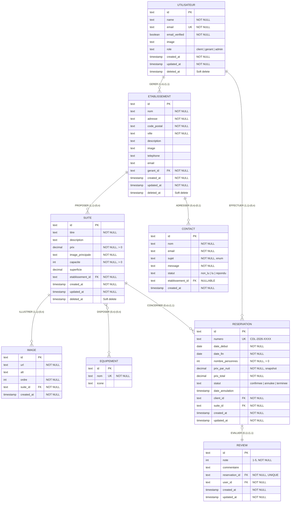
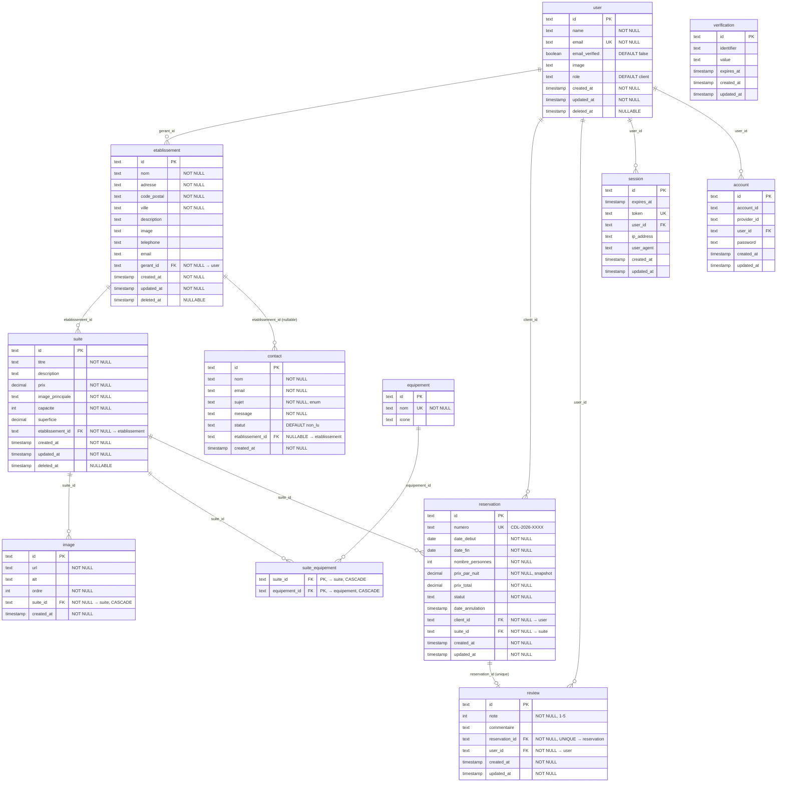
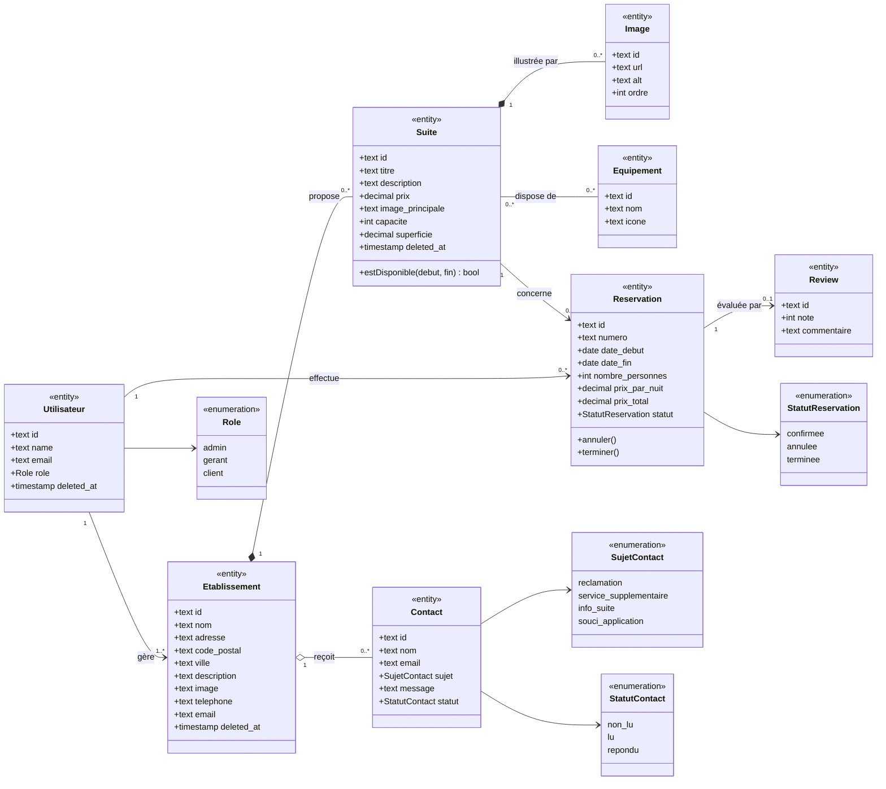
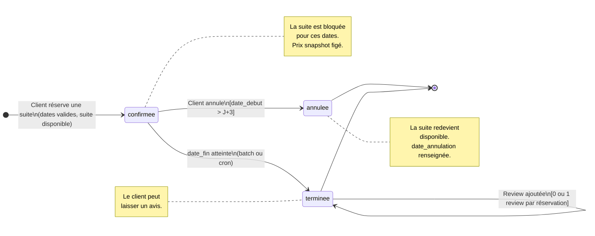
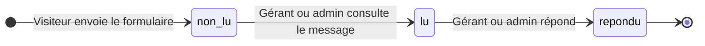
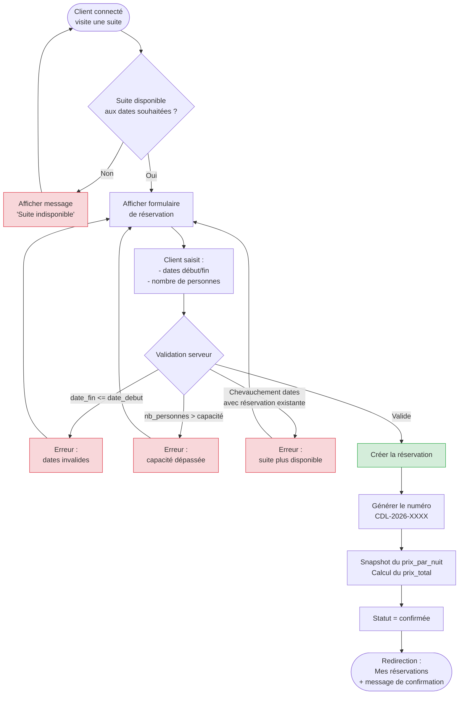

# MERISE — Hôtel Clair de Lune

> **Auteur :** Julien Lemarchand
> **Créé le :** 2026-03-17
> **Dernière mise à jour :** 2026-03-17
> **Décisions validées le :** 2026-03-17

---

## 1. MCD — Modèle Conceptuel de Données

### 1.1 Dictionnaire de données

#### UTILISATEUR (user)

| Attribut | Type | Obligatoire | Description |
|---|---|---|---|
| id | Identifiant | Oui | Clé primaire (géré par Better Auth) |
| name | Texte | Oui | Nom complet |
| email | Texte | Oui | Adresse e-mail (unique) |
| email_verified | Booléen | Oui | E-mail vérifié |
| image | Texte | Non | Avatar / photo de profil |
| role | Texte | Oui | Rôle : `client`, `gerant`, `admin` |
| created_at | Horodatage | Oui | Date de création |
| updated_at | Horodatage | Oui | Date de dernière modification |
| deleted_at | Horodatage | Non | Soft delete (null = actif) |

> **Note :** Les tables `session`, `account` et `verification` de Better Auth ne sont pas représentées dans le MCD car elles relèvent de l'infrastructure d'authentification, pas du domaine métier.

#### ETABLISSEMENT

| Attribut | Type | Obligatoire | Description |
|---|---|---|---|
| id | Identifiant | Oui | Clé primaire |
| nom | Texte | Oui | Nom de l'établissement |
| adresse | Texte | Oui | Adresse postale |
| code_postal | Texte | Oui | Code postal |
| ville | Texte | Oui | Ville |
| description | Texte | Non | Description de l'établissement |
| image | Texte | Non | Image principale |
| telephone | Texte | Non | Numéro de téléphone |
| email | Texte | Non | E-mail de contact |
| created_at | Horodatage | Oui | Date de création |
| updated_at | Horodatage | Oui | Date de dernière modification |
| deleted_at | Horodatage | Non | Soft delete (null = actif) |

#### SUITE

| Attribut | Type | Obligatoire | Description |
|---|---|---|---|
| id | Identifiant | Oui | Clé primaire |
| titre | Texte | Oui | Nom de la suite |
| description | Texte | Non | Description détaillée |
| prix | Décimal | Oui | Prix par nuit (fixe) |
| image_principale | Texte | Oui | URL de l'image principale |
| capacite | Entier | Oui | Nombre de personnes max |
| superficie | Décimal | Non | Surface en m² |
| created_at | Horodatage | Oui | Date de création |
| updated_at | Horodatage | Oui | Date de dernière modification |
| deleted_at | Horodatage | Non | Soft delete (null = actif) |

#### IMAGE

| Attribut | Type | Obligatoire | Description |
|---|---|---|---|
| id | Identifiant | Oui | Clé primaire |
| url | Texte | Oui | URL de l'image |
| alt | Texte | Non | Texte alternatif (accessibilité) |
| ordre | Entier | Oui | Position dans la galerie |
| created_at | Horodatage | Oui | Date de création |

#### EQUIPEMENT

| Attribut | Type | Obligatoire | Description |
|---|---|---|---|
| id | Identifiant | Oui | Clé primaire |
| nom | Texte | Oui | Nom (WiFi, Minibar, Parking…) |
| icone | Texte | Non | Nom d'icône ou URL pour l'affichage |

#### RESERVATION

| Attribut | Type | Obligatoire | Description |
|---|---|---|---|
| id | Identifiant | Oui | Clé primaire |
| numero | Texte | Oui | Référence lisible (ex: CDL-2026-0042) |
| date_debut | Date | Oui | Début du séjour |
| date_fin | Date | Oui | Fin du séjour |
| nombre_personnes | Entier | Oui | Nombre de personnes |
| prix_par_nuit | Décimal | Oui | Snapshot du prix au moment de la réservation |
| prix_total | Décimal | Oui | Prix total (nb nuits × prix/nuit) |
| statut | Texte | Oui | `confirmee`, `annulee`, `terminee` |
| date_annulation | Horodatage | Non | Date d'annulation (si applicable) |
| created_at | Horodatage | Oui | Date de création de la réservation |
| updated_at | Horodatage | Oui | Date de dernière modification |

#### REVIEW (Avis)

| Attribut | Type | Obligatoire | Description |
|---|---|---|---|
| id | Identifiant | Oui | Clé primaire |
| note | Entier | Oui | Note de 1 à 5 |
| commentaire | Texte | Non | Commentaire textuel |
| created_at | Horodatage | Oui | Date de publication |
| updated_at | Horodatage | Oui | Date de dernière modification |

#### CONTACT

| Attribut | Type | Obligatoire | Description |
|---|---|---|---|
| id | Identifiant | Oui | Clé primaire |
| nom | Texte | Oui | Nom de l'expéditeur |
| email | Texte | Oui | E-mail de l'expéditeur |
| sujet | Texte | Oui | Sujet prédéfini |
| message | Texte | Oui | Corps du message |
| statut | Texte | Oui | `non_lu`, `lu`, `repondu` |
| created_at | Horodatage | Oui | Date d'envoi |

### 1.2 Entités et associations

> Le diagramme ci-dessous utilise la notation ERD de Mermaid pour représenter
> le MCD. Les cardinalités sont exprimées avec la notation Crow's Foot.



### 1.3 Détail des associations et cardinalités

| Association | Entité A | Cardinalité A | Entité B | Cardinalité B | Description |
|---|---|---|---|---|---|
| **GERER** | Utilisateur (gérant) | 1,n | Etablissement | 1,1 | Un gérant gère 1 à N établissements. Un établissement a exactement un gérant. |
| **PROPOSER** | Etablissement | 1,1 | Suite | 0,n | Un établissement propose 0 à N suites. Une suite appartient à un seul établissement. |
| **ILLUSTRER** | Suite | 1,1 | Image | 0,n | Une suite possède 0 à N images dans sa galerie. Une image appartient à une seule suite. |
| **DISPOSER** | Suite | 0,n | Equipement | 0,n | Une suite dispose de 0 à N équipements. Un équipement peut être dans 0 à N suites. (many-to-many) |
| **EFFECTUER** | Utilisateur (client) | 1,1 | Reservation | 0,n | Un client effectue 0 à N réservations. Une réservation est effectuée par un seul client. |
| **CONCERNER** | Suite | 0,n | Reservation | 1,1 | Une suite est concernée par 0 à N réservations. Une réservation concerne une seule suite. |
| **EVALUER** | Reservation | 0,1 | Review | 1,1 | Une réservation peut avoir 0 ou 1 avis. Un avis est lié à exactement une réservation. |
| **ADRESSER** | Contact | 0,1 | Etablissement | 0,n | Un message de contact est adressé à un établissement (nullable si sujet technique). Un établissement reçoit 0 à N messages. |

### 1.4 Règles de gestion

1. **Rôles :** Un utilisateur a un seul rôle (`admin`, `gerant`, `client`). Le visiteur n'est pas un utilisateur (pas de compte).
2. **Gérant → Établissement(s) :** Relation 1:N. Un gérant peut gérer plusieurs établissements (ex: hôtels proches géographiquement). Un établissement a exactement un gérant.
3. **Prix fixe :** Le prix d'une suite est fixe quelle que soit la période. Au moment de la réservation, le prix est copié (`prix_par_nuit`) pour garantir l'intégrité historique.
4. **Disponibilité :** Une suite ne peut pas être réservée deux fois sur des dates qui se chevauchent (contrôle : `new_start < existing_end AND new_end > existing_start`).
5. **Annulation :** Possible uniquement si la date de début est dans plus de 3 jours. Le statut passe à `annulee`, la suite redevient disponible.
6. **Suppression douce :** Les établissements, suites et utilisateurs ne sont jamais supprimés physiquement. Le champ `deleted_at` est renseigné.
7. **Review :** Un avis ne peut être laissé que sur une réservation au statut `terminee`, et un seul avis par réservation.
8. **Contact :** Les sujets sont prédéfinis (réclamation, service supplémentaire, info suite, souci application).

---

## 2. MLD — Modèle Logique de Données

> Le MLD est la traduction du MCD en tables relationnelles. Chaque entité devient une table,
> chaque association se traduit par une clé étrangère (relation 1:N) ou une table de jointure (relation N:N).

### 2.1 Règles de passage MCD → MLD appliquées

| Règle | Application dans notre modèle |
|---|---|
| Entité → Table | Chaque entité du MCD devient une table |
| Association 1:N → FK | La clé étrangère est placée côté "N" (ex: `etablissement.gerant_id`) |
| Association N:N → Table de jointure | DISPOSER (Suite ↔ Equipement) → table `suite_equipement` |
| Association 1:1 → FK + contrainte UNIQUE | EVALUER (Reservation ↔ Review) → `review.reservation_id` UNIQUE |

### 2.2 Schéma relationnel

#### Tables issues de Better Auth (infrastructure — déjà en place)

```
session (id, expires_at, token, created_at, updated_at, ip_address, user_agent, #user_id)
account (id, account_id, provider_id, #user_id, access_token, refresh_token, id_token,
         access_token_expires_at, refresh_token_expires_at, scope, password, created_at, updated_at)
verification (id, identifier, value, expires_at, created_at, updated_at)
```

> Ces tables ne sont pas modifiées. Elles sont gérées par Better Auth.

#### Tables métier

```
user (id, name, email, email_verified, image, role, created_at, updated_at, deleted_at)
  PK: id
  UNIQUE: email
  CHECK: role IN ('admin', 'gerant', 'client')
  DEFAULT: role = 'client'
  NOTE: table existante Better Auth, enrichie avec role + deleted_at

etablissement (id, nom, adresse, code_postal, ville, description, image, telephone, email,
               created_at, updated_at, deleted_at, #gerant_id)
  PK: id
  FK: gerant_id → user(id)
  NOT NULL: nom, adresse, code_postal, ville, gerant_id

suite (id, titre, description, prix, image_principale, capacite, superficie,
       created_at, updated_at, deleted_at, #etablissement_id)
  PK: id
  FK: etablissement_id → etablissement(id)
  NOT NULL: titre, prix, image_principale, capacite, etablissement_id
  CHECK: prix > 0, capacite > 0

image (id, url, alt, ordre, created_at, #suite_id)
  PK: id
  FK: suite_id → suite(id) ON DELETE CASCADE
  NOT NULL: url, ordre, suite_id

equipement (id, nom, icone)
  PK: id
  UNIQUE: nom

suite_equipement (#suite_id, #equipement_id)
  PK: (suite_id, equipement_id)
  FK: suite_id → suite(id) ON DELETE CASCADE
  FK: equipement_id → equipement(id) ON DELETE CASCADE

reservation (id, numero, date_debut, date_fin, nombre_personnes, prix_par_nuit,
             prix_total, statut, date_annulation, created_at, updated_at,
             #client_id, #suite_id)
  PK: id
  UNIQUE: numero
  FK: client_id → user(id)
  FK: suite_id → suite(id)
  NOT NULL: numero, date_debut, date_fin, nombre_personnes, prix_par_nuit,
            prix_total, statut, client_id, suite_id
  CHECK: statut IN ('confirmee', 'annulee', 'terminee')
  CHECK: date_fin > date_debut
  CHECK: prix_par_nuit > 0, prix_total > 0, nombre_personnes > 0
  CONTRAINTE METIER: pas de chevauchement de dates pour une même suite

review (id, note, commentaire, created_at, updated_at, #reservation_id, #user_id)
  PK: id
  UNIQUE: reservation_id  (un seul avis par réservation)
  FK: reservation_id → reservation(id) ON DELETE CASCADE
  FK: user_id → user(id)
  NOT NULL: note, reservation_id, user_id
  CHECK: note BETWEEN 1 AND 5
  CONTRAINTE METIER: réservation au statut 'terminee' uniquement

contact (id, nom, email, sujet, message, statut, created_at, #etablissement_id)
  PK: id
  FK: etablissement_id → etablissement(id)  -- NULLABLE (null = sujet technique global)
  NOT NULL: nom, email, sujet, message, statut
  CHECK: sujet IN ('reclamation', 'service_supplementaire', 'info_suite', 'souci_application')
  CHECK: statut IN ('non_lu', 'lu', 'repondu')
  DEFAULT: statut = 'non_lu'
```

### 2.3 Diagramme relationnel (MLD)

> Ce diagramme ERD Mermaid représente le MLD complet avec toutes les tables,
> y compris la table de jointure `suite_equipement` issue de la relation N:N.



### 2.4 Récapitulatif des clés étrangères

| Table source | Colonne FK | Table cible | Cardinalité | ON DELETE |
|---|---|---|---|---|
| `etablissement` | `gerant_id` | `user` | N:1 | RESTRICT |
| `suite` | `etablissement_id` | `etablissement` | N:1 | RESTRICT |
| `image` | `suite_id` | `suite` | N:1 | CASCADE |
| `suite_equipement` | `suite_id` | `suite` | N:N (jointure) | CASCADE |
| `suite_equipement` | `equipement_id` | `equipement` | N:N (jointure) | CASCADE |
| `reservation` | `client_id` | `user` | N:1 | RESTRICT |
| `reservation` | `suite_id` | `suite` | N:1 | RESTRICT |
| `review` | `reservation_id` | `reservation` | 1:1 | CASCADE |
| `review` | `user_id` | `user` | N:1 | RESTRICT |
| `contact` | `etablissement_id` | `etablissement` | N:1 (nullable) | SET NULL |

### 2.5 Choix des ON DELETE

| Stratégie | Appliquée quand | Exemple |
|---|---|---|
| **RESTRICT** | Empêcher la suppression si des données liées existent | Supprimer un user qui a des réservations → bloqué |
| **CASCADE** | La suppression en cascade est logique métier | Supprimer une suite → ses images de galerie disparaissent |
| **SET NULL** | Le lien peut devenir orphelin sans casser la logique | Supprimer un établissement → les contacts techniques restent (etablissement_id = null) |

> **Note :** En pratique, grâce au soft delete (`deleted_at`), on ne supprime presque jamais physiquement un établissement, une suite ou un user. Les ON DELETE RESTRICT servent de filet de sécurité.

---

## 3. Diagrammes complémentaires

### 3.1 Modèle de domaine (Class Diagram)

> Vue orientée objet du domaine métier. Ce diagramme montre les entités
> avec leurs attributs clés, les relations typées (composition, agrégation,
> association) et les multiplicités.



### 3.2 Cycle de vie d'une réservation (State Diagram)

> Ce diagramme d'état modélise les transitions possibles du statut
> d'une réservation, avec les conditions de garde (guards).



### 3.3 Cycle de vie d'un message de contact (State Diagram)



### 3.4 Flux de réservation (Flowchart)

> Processus complet de création d'une réservation, du point de vue utilisateur
> et des contrôles métier côté serveur.



---

## 4. MPD — Modèle Physique de Données

_Correspondra au schéma Drizzle dans `db/schema.ts`._
